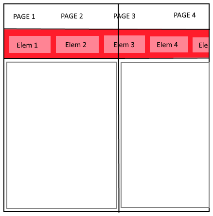

**WinUI** API Specification : **ScrollViewer**

# Background

(Full Summary, Rationale, and High-Level Plan in the proposal on GitHub: [A more flexible ScrollViewer](https://github.com/Microsoft/microsoft-ui-xaml/issues/108))

Xaml has a ScrollViewer control for scrolling content with scroll bars and panning, etc. Typical uses are as the root of a page whose content might not fit; and a ListView, which uses a ScrollViewer for its list of items. For example:

```xml
<Page xmlns="http://schemas.microsoft.com/winfx/2006/xaml/presentation">
    <ScrollViewer>
        <TextBlock Text="{x:Bind AllTheText}" TextWrapping="Wrap" />
    </ScrollViewer>
</Page>
```

The touch support in ScrollViewer is implemented with [DirectManipulation](https://docs.microsoft.com/en-us/previous-versions/windows/desktop/directmanipulation/direct-manipulation-portal), and has a lot of complicated history and implementation. And DirectManipulation is deprecated, replaced by [InteractionTracker](https://docs.microsoft.com/en-us/uwp/api/Windows.UI.Composition.Interactions.InteractionTracker).

So this spec describes a new ScrollViewer control. This new control has highly aligned in behavior and API with the  control, but is based on InteractionTracker, and has new features such as zoom.

In order to ease the transition from the old control to the new control, the new control has the same name in a new namespace; the existing Windows.UI.Xaml.Controls.ScrollViewer is being replaced by the Microsoft.UI.Xaml.Controls.ScrollViewer (WUX to MUX). So the above example becomes:

```xml
<Page xmlns=<http://schemas.microsoft.com/winfx/2006/xaml/presentation>
      xmlns:mux="using:Microsoft.UI.Xaml.Controls" >
    <mux:ScrollViewer>
        <TextBlock Text="{x:Bind AllTheText}" TextWrapping="Wrap" />
    </mux:ScrollViewer>
</Page>
```

A few key points:
  - This is a reimplementation of the ScrollViewer control that will target in-market versions of the OS. It will rely solely on publicly exposed platform APIs (1<sup>st</sup> party == 3<sup>rd</sup> party).
  - The public API will largely mirror the existing control to minimize barriers to adoption.
  - The API will differ in key areas that we believe will address top points of developer confusion with the existing control and/or provide meaningful improvements. For each scenario in this spec the code for both the new ScrollViewer (Microsoft.UI.Xaml) and the existing one (Windows.UI.Xaml) are provided.

## Benefits of an InteractionTracker-based Scrolling Control

Most ScrollViewer usage is indirect.  It happens simply because ScrollViewer is within another control's template. The old ScrollViewer works well enough for those scenarios.  However, if when an app needs to directly use a ScrollViewer it can encounter the limitations that relate to what DManip supports.  A new InteractionTracker-based ScrollViewer could unlock a number of new capabilities that are otherwise not possible.
These are benefits for an InteractionTracker-based scrolling/zooming control compared to the DirectManipulation-based WUX ScrollViewer.

<table>
<thead>
<tr class="header">
<th><strong>Benefits</strong></th>
<th><strong>Details</strong></th>
</tr>
</thead>
<tbody>
<tr class="odd">
<td>Developers can control programmatic view change curve</td>
<td>Developers can provide a composition animation that specifies the curve followed by the offsets or the zoom factor when programmatically going from view A to view B.</td>
</tr>
<tr class="even">
<td>Programmatic view changes based on additional velocity</td>
<td>Both offsets and zoom factor can be changed with an additional velocity.</td>
</tr>
<tr class="odd">
<td>Control can be first class façade / IAnimatable citizen</td>
<td>InteractionTracker-based control can implement new Composition IAnimatable interface and take fully advantage of façades.</td>
</tr>
<tr class="even">
<td>Access to velocities</td>
<td><p>Developers have access to the offsets and zoom factor velocities.</p>
<p> </p>
<p>For instance, those velocities are exposed when an inertia phase starts.</p></td>
</tr>
<tr class="odd">
<td>Developers can control inertial view change curve and destination</td>
<td><p>Developers can alter the inertial curve by controlling its velocity decay and final rest point.</p>
<p> </p>
<p>This allows flexibility in snap points implementation for instance.</p></td>
</tr>
<tr class="even">
<td>Developers can control input-driven view change curve</td>
<td><p>Developers can provide composition expressions for controlling the finger down behaviors.</p>
<p> </p>
<p>This allows flexibility in gravity wells implementation for instance.</p></td>
</tr>
<tr class="odd">
<td>UI-thread-independent mouse wheel scrolling and zooming</td>
<td><p>(DManip only supports UI-thread-bound manipulations for mouse wheel)</p>
<p> </p>
<p>InteractionTracker supports optional independent handling of mouse wheel input.</p></td>
</tr>
<tr class="even">
<td>Access to inertia trigger</td>
<td>Developers have access to the nature of the inertia trigger: mouse wheel or touch input.</td>
</tr>
<tr class="odd">
<td>DirectManipulation in maintenance mode</td>
<td><p>No significant investment is being made in this technology.</p>
<p> </p>
<p>On the other hand, feature requests for the InteractionTracker are more likely to be fulfilled by the Composition team.</p></td>
</tr>
</tbody>
</table>


# Design overview

## Overall picture

We're introducing two new elements, ScrollViewer and Scroller. Applications typically use the ScrollViewer, and the ScrollViewer by default uses a Scroller in its implementation. The Scroller provides the primitive functionality of clipping and translating content, the ScrollViewer wraps that and two ScrollBars into the composite experience.

The Scroller element provides a scrollable viewport using the Composition [InteractionTracker](https://docs.microsoft.com/en-us/uwp/api/Windows.UI.Composition.Interactions.InteractionTracker) and has all the essential scrolling & zooming logic. It is a FrameworkElement (not control) and therefore has no default template. Although it cannot take focus directly, it does respond to keyboard and/or Narrator focus events that occur on elements within its sub-tree to automatically bring them into view. It also includes support for accessibility and interacts with the XAML layout system (for instance clips its content) & supports scroll anchoring. Note that scroll anchoring is the ability to change details of the Scroller's content without altering the content portion seen by the user. A concrete example is the ability to add and remove emails in an emails list without shifting around the few email subjects seen by the user.

It is a low-level building block, without any user interaction widgets like scrollbars, that the ScrollViewer builds on top of.

The ScrollViewer adds the default user interaction widgets (scrollbars, scroll indicator, etc.) and policy. As a Control it can be templated and receive keyboard focus. It has the built-in logic to decide whether to scroll the viewport or move focus in response to a key event. It sets the properties on its Scroller to common values. For example, the basic `<ScrollViewer/>` is configured for vertical scrolling. By default, the ScrollViewer has a Scroller in its template in addition to a horizontal and vertical (conscious) ScrollBar and the filler rectangle for the corner where the two scroll bars meet. Many scrolling/zooming-specific properties/methods/events in Scroller are replicated at the ScrollViewer level.

The default choice for apps should be to use ScrollViewer which ensures platform consistency with conscious scroll bars. Scroller is most useful for control authors that need a scrolling element and will apply custom policy. For example, if someone were to make their own "FlipView-like" control then Scroller would be the one to use.

## Default ScrollViewer control template

The new ScrollViewer uses a Scroller and lives in the Microsoft.UI.Xaml namespace as part of the WinUI Nuget package. The chrome elements come from WUX: two ScrollBars, a Border, all inside a Grid.

```xml
<Style TargetType="local:ScrollViewer">
    <Setter Property="Background" Value="Transparent"/>
    <Setter Property="IsTabStop" Value="False"/>
    <Setter Property="UseSystemFocusVisuals" Value="{StaticResource UseSystemFocusVisuals}"/>
    <Setter Property="ContentOrientation" Value="Vertical"/>
    <Setter Property="HorizontalScrollMode" Value="Enabled"/>
    <Setter Property="HorizontalScrollChainingMode" Value="Auto"/>
    <Setter Property="IsHorizontalRailEnabled" Value="True"/>
    <Setter Property="VerticalScrollMode" Value="Enabled"/>
    <Setter Property="VerticalScrollChainingMode" Value="Auto"/>
    <Setter Property="IsVerticalRailEnabled" Value="True"/>
    <Setter Property="ZoomChainingMode" Value="Auto"/>
    <Setter Property="ZoomMode" Value="Disabled"/>
    <Setter Property="IgnoredInputKind" Value="None"/>
    <Setter Property="MinZoomFactor" Value="0.1"/>
    <Setter Property="MaxZoomFactor" Value="10.0"/>
    <Setter Property="HorizontalAnchorRatio" Value="0.0"/>
    <Setter Property="VerticalAnchorRatio" Value="0.0"/>
    <Setter Property="Template">
    <Setter.Value>
        <ControlTemplate TargetType="local:ScrollViewer">
            <Grid x:Name="PART_Root">
                <VisualStateManager.VisualStateGroups>
                    ...
                </VisualStateManager.VisualStateGroups>
                <Grid.RowDefinitions>
                    <RowDefinition Height="*"/>
                    <RowDefinition Height="Auto"/>
                </Grid.RowDefinitions>
                <Grid.ColumnDefinitions>
                    <ColumnDefinition Width="*"/>
                    <ColumnDefinition Width="Auto"/>
                </Grid.ColumnDefinitions>
                <local:Scroller x:Name="PART_Scroller"
                                Grid.ColumnSpan="2" Grid.RowSpan="2"
                                Background="{TemplateBinding Background}"
                                Margin="{TemplateBinding Padding}"
                                Content="{TemplateBinding Content}"
                                ContentOrientation="{TemplateBinding ContentOrientation}"
                                HorizontalScrollMode="{TemplateBinding HorizontalScrollMode}"
                                VerticalScrollMode="{TemplateBinding VerticalScrollMode}"
                                HorizontalScrollChainingMode="{TemplateBinding HorizontalScrollChainingMode}"
                                IsHorizontalRailEnabled="{TemplateBinding IsHorizontalRailEnabled}"
                                VerticalScrollChainingMode="{TemplateBinding VerticalScrollChainingMode}"
                                IsVerticalRailEnabled="{TemplateBinding IsVerticalRailEnabled}"
                                ZoomMode="{TemplateBinding ZoomMode}"
                                ZoomChainingMode="{TemplateBinding ZoomChainingMode}"
                                IgnoredInputKind="{TemplateBinding IgnoredInputKind}"
                                MinZoomFactor="{TemplateBinding MinZoomFactor}"
                                MaxZoomFactor="{TemplateBinding MaxZoomFactor}"
                                HorizontalAnchorRatio="{TemplateBinding HorizontalAnchorRatio}"
                                VerticalAnchorRatio="{TemplateBinding VerticalAnchorRatio}"/>
                    <ScrollBar x:Name="PART_HorizontalScrollBar"
                               Grid.Row="1"
                               Orientation="Horizontal"
                               HorizontalAlignment="Stretch"
                               Visibility="{TemplateBinding ComputedHorizontalScrollBarVisibility}"/>
                    <ScrollBar x:Name="PART_VerticalScrollBar"
                               Grid.Column="1"
                               Orientation="Vertical"
                               VerticalAlignment="Stretch"
                               Visibility="{TemplateBinding ComputedVerticalScrollBarVisibility}"/>
                    <Border x:Name="PART_ScrollBarsSeparator"
                            Grid.Row="1"
                            Grid.Column="1"
                            Opacity="0"
                            Background="{ThemeResource ScrollerViewScrollBarsSeparatorBackground}"/>
            </Grid>
        </ControlTemplate>
        </Setter.Value>
    </Setter>
</Style>
```

For those familiar with the existing template for the WUX ScrollViewer control, the Scroller element takes the role of the ScrollContentPresenter.

## 2.3 Typical XAML markup

Most of the time, developers simply wrap content with a ScrollViewer to enable a default vertical scrolling UX when the content is too large to fit in the user visible area.

```xml
<mux:ScrollViewer>
    <mux:ItemsRepeater ItemsSource="{x:Bind Items}" ItemTemplate="{StaticResource MyTemplate}"/>
</mux:ScrollViewer>
```

# Supported ScrollViewer Scenarios

The following sections show example usages of ScrollViewer. For most of these sections, it is shown how the same scenario is accomplished in the existing (WUX) ScrollViewer as well.

## Layout of Content in XAML Markup

This section focuses on properties that let the developer define the visual layout of the ScrollViewer.

### Setting the scrollable content

This example sets an image, which will be displayed at its natural size, but only up to a 500x400 viewport will be displayed.

**Microsoft**.UI.Xaml (**New**)

```xml
<mux:ScrollViewer Width="500" Height="400">
    <Image Source="Assets/LargeEiffelTower.png"/>
</mux:ScrollViewer>
```

**Windows**.UI.Xaml

Similar to above.

#### Member description

| **Property** | **Description**                                                                                                                                                            | **Type**                  | **Default Value** | **Dependency property?** |
| ------------ | -------------------------------------------------------------------------------------------------------------------------------------------------------------------------- | ------------------------- | ----------------- | ------------------------ |
| Content      | Gets or sets the scrollable/zoomable content.                                                                                                                              | Windows.UI.Xaml.UIElement | null              | Yes                      |
| **Comments** | The Content property is marked as being the ContentProperty for both the Scroller and ScrollViewer controls, in their respective IDL files: `[contentproperty("Content")]` |                           |                   |                          |

### Controlling the layout orientation

The layout of the ScrollViewer's content can be vertical, horizontal, or neither. Vertical means that the user can scroll/pan the content up and down, horizontal means left and right. The ScrollViewer's content will attempt to arrange itself to fit.

#### Vertical layout

In the following example, an ItemsRepeater is in a ScrollViewer. The ItemsRepeater wraps its items laid out horizontally based on the width of the containing ScrollViewer.

**Microsoft**.UI.Xaml markup

```xml
<mux:ScrollViewer Width="500" Height="400">
    <mux:ItemsRepeater ItemsSource="{x:Bind Albums}" ItemTemplate="{StaticResource MyTemplate}">
        <mux:ItemsRepeater.Layout>
            <mux:UniformGridLayout RowSpacing="8" ColumnSpacing="8"/>
        </mux:ItemsRepeater.Layout>
    </mux:ItemsRepeater>
</mux:ScrollViewer>
```

**Windows**.UI.Xaml markup

Similar to above.

#### Horizontal layout

Example that uses the Horizontal orientation. The StackPanel arranges its items in a horizontal fashion - its available height is the available height of the containing ScrollViewer.

**Microsoft**.UI.Xaml **(New)**

```xml
<mux:ScrollViewer Width="500" Height="400"
                  ContentOrientation="Horizontal">
    <StackPanel Orientation="Horizontal">
        <Button Width="300" Content="Button1"/>
        <Button Width="300" Content="Button2"/>
        <Button Width="300" Content="Button3"/>
        <Button Width="300" Content="Button4"/>
        <Button Width="300" Content="Button5"/>
    </StackPanel>
</mux:ScrollViewer>
```

**Windows**.UI.Xaml

```xml
<ScrollViewer Width="500" Height="400"
    HorizontalScrollBarVisibility="Auto" VerticalScrollBarVisibility="Disabled">
    <StackPanel Orientation="Horizontal">
        <Button Width="300" Content="Button1"/>
        <Button Width="300" Content="Button2"/>
        <Button Width="300" Content="Button3"/>
        <Button Width="300" Content="Button4"/>
        <Button Width="300" Content="Button5"/>
    </StackPanel>
</ScrollViewer>
```

#### Two-dimensional (Unconstrained) layout

In this example the ContentOrientation is set to None, indicating that the content can be panned/scrolled both horizontally and vertically. The content's layout is unconstrained, meaning that it can be as wide and high as it wants to be.

**Microsoft**.UI.Xaml (**New**)

```xml
<mux:ScrollViewer Width="500" Height="400" ContentOrientation="None">
    <Image Source="Assets/LargeEiffelTower.png"/>
</mux:ScrollViewer>
```

**Windows**.UI.Xaml

```xml
<ScrollViewer Width="500" Height="400" HorizontalScrollBarVisibility="Auto">
    <Image Source="Assets/LargeEiffelTower.png"/>
</ScrollViewer>
```

The Image's natural size may be 2880 x 1800 and would be rendered using that size.

#### A Photo Viewer - Constrained to the Viewport Layout

In this scenario the content will, at a minimum, always appear to fill the viewport while preserving its aspect ratio. A user may choose to zoom in and pan the content. This kind of scenario is most common with a photo viewer experience.

**Microsoft**.UI.Xaml (**New**)

```xml
<mux:ScrollViewer ContentOrientation="Both">
    <Image Stretch="Uniform" Source="Assets/LargeEiffelTower.png"/>
</mux:ScrollViewer>
```

OR more generally for any XAML content a Viewbox could still be used.

```xml
<mux:ScrollViewer ContentOrientation="Both">
    <Viewbox>
        <TheXamlElement Width="X" Height="Y"/>
    </Viewbox>
</mux:ScrollViewer>
```

**Windows**.UI.Xaml

In the past this required inserting a Viewbox and binding its MaxHeight/MaxWidth to the ViewportHeight/ViewportWidth of the ScrollView which is literally just trying to constrain the layout of Viewbox to the size of the viewport. Having a "Both" option on the ContentOrientation enables the same thing in a more performant way with less markup/code.

```xml
<ScrollViewer x:Name="outputScrollViewer" HorizontalScrollBarVisibility="Auto">
    <Viewbox MaxWidth="{x:Bind outputScrollViewer.ViewportWidth, Mode=OneWay}"  
             MaxHeight="{x:Bind outputScrollViewer.ViewportHeight, Mode=OneWay}">
        <Image Width="X" Height="Y"/>
    </Viewbox>
</ScrollViewer>
```

#### Related enum

Namespace: Microsoft.UI.Xaml.Controls

```csharp
public enum ContentOrientation 
{ 
    Vertical = 0,
    Horizontal = 1,
    None = 2,
    //Bounds = 3
    //  OR
    //Both = 3
} 
```

#### Member description

<table>
<thead>
<tr class="header">
<th><strong>Property</strong></th>
<th><strong>Description</strong></th>
<th><strong>Type</strong></th>
<th><strong>Default Value</strong></th>
<th><strong>Dependency property?</strong></th>
</tr>
</thead>
<tbody>
<tr class="odd">
<td>ContentOrientation</td>
<td>Gets or sets the preferred content orientation.</td>
<td>Microsoft.U Contentontrols.ContentOrientation</td>
<td>Vertical</td>
<td>Yes</td>
</tr>
<tr class="even">
<td><strong>Comments</strong></td>
<td><p>In the ScrollViewer's control template, the Scroller's ContentOrientation is template-bound to the ScrollViewer's value.</p>
<p>The ContentOrientation property affects the Scroller's MeasureOverride behavior:</p>
<ul>
<li><p>When the Vertical orientation is applied, the Scroller.Content's available width is set to the Scroller's available width. Otherwise, the Scroller.Content's available width is infinity.</p></li>
<li><p>When the Horizontal orientation is applied, the Scroller.Content's available height is set to the Scroller's available height. Otherwise, the Scroller.Content's available height is infinity.</p></li>
</ul></td>
<td></td>
<td></td>
<td></td>
</tr>
</tbody>
</table>

### Controlling the presence of scroll controllers

A scroll controller is a component, with or without UI, that can be associated with a scroller control and can read and write its scroll offset for one dimension. A familiar scroll controller is the scrollbar control, in this case a UI widget.

A scroll controller is characterized by its implementation of the new IScrollController interface. It communicates with the associated scroller through that interface. The scroller can have up to one controller for the horizontal dimension, and up to one for the vertical dimension. The IScrollController interface is detailed [here](#iscrollcontroller-interface-and-dependent-classes).

#### Example - Using the default Auto settings

1.  Mouse cursor is over the conscious vertical scroll controller. Only the vertical scroll controller appears because the content is not wider than the viewport.

2.  The mouse cursor is over the control. Because the content is larger than the viewport in both directions, the two conscious scroll controllers and their separator appear.

In the previous example only the vertical scroll controller appears momentarily because the content is not wide enough.

A conscious scroll controller appears momentarily whether the mouse pointer is over the ScrollViewer or over its area - although its rendering is different. If there is no mouse movement, the conscious scroll controller disappears after a timeout.

#### Hiding both scroll controllers

**Microsoft**.UI.Xaml (**New**)

```xml
<mux:ScrollViewer Width="500" Height="400"
                  ContentOrientation="None"
                  HorizontalScrollBarVisibility="Hidden"
                  VerticalScrollBarVisibility="Hidden">
    <Image Source="Assets/LargeParisMap.png"/>
</mux:ScrollViewer>
```

**Windows**.UI.Xaml

```xml
<ScrollViewer Width="500" Height="400"
              HorizontalScrollBarVisibility="Hidden"
              VerticalScrollBarVisibility="Hidden">
    <Image Source="Assets/LargeParisMap.png"/>
</ScrollViewer>
```

#### Member description

<table>
<thead>
<tr class="header">
<th><strong>Property</strong></th>
<th><strong>Description</strong></th>
<th><strong>Type</strong></th>
<th><strong>Default Value</strong></th>
<th><strong>Dependency property?</strong></th>
</tr>
</thead>
<tbody>
<tr class="odd">
<td>HorizontalScrollBarVisibility</td>
<td>Gets or sets a value that indicates whether a scroll controller should be displayed for the horizontal scrolling direction.</td>
<td>Microsoft.UI.Xaml.Controls.ScrollBarVisibility</td>
<td>Auto</td>
<td>Yes</td>
</tr>
<tr class="even">
<td>VerticalScrollBarVisibility</td>
<td>Gets or sets a value that indicates whether a scroll controller should be displayed for the vertical scrolling direction.</td>
<td>Microsoft.UI.Xaml.Controls.ScrollBarVisibility</td>
<td>Auto</td>
<td>Yes</td>
</tr>
<tr class="odd">
<td><strong>Comments</strong></td>
<td><p>The ScrollViewer's control template can include a part called PART_HorizontalScrollBar. That element can either implement Microsoft.UI.Xaml.Controls.IScrollController or be a WUX ScrollBar. The default ScrollViewer template uses a vertical WUX ScrollBar.</p>
<p>An element that implements Microsoft.UI.Xaml.Controls.IScrollController can provide richer user experiences than a ScrollBar. It can include inertia-driven offset changes, UI-thread independent scrolling through touch/pen.</p>
<p>When set to Visible, the scroll controller's Visibility is set to Visible.</p>
<p>When set to Hidden, the scroll controller's Visibility is set to Collapsed.</p>
<p>When set to Auto, the scroll controller's Visibility is set to Visible only when the ZoomFactor x ExtentWidth is larger than the ViewportWidth, otherwise it is Collapsed.</p>
<p>Equivalent comments apply to the vertical direction.</p></td>
<td></td>
<td></td>
<td></td>
</tr>
</tbody>
</table>

**Related enum**

Namespace: Microsoft.UI.Xaml.Controls

```csharp
public enum ScrollBarVisibility 
{ 
    Auto = 0,
    Visible = 1,
    Hidden = 2
} 
```

### Setting the background brush

**Microsoft**.UI.Xaml (**New**)

```xml
<mux:ScrollViewer Background="Cyan">
    <!-- ... -->
</mux:ScrollViewer>
```

**Windows**.UI.Xaml

Similar to above.

#### Member description

| **Property** | **Description**                                                                                                                                          | **Type**                    | **Default Value**  | **Dependency property?** |
| ------------ | -------------------------------------------------------------------------------------------------------------------------------------------------------- | --------------------------- | ------------------ | ------------------------ |
| Background   | Gets or sets the background brush of the control.                                                                                                        | Windows.UI.Xaml.Media.Brush | Colors.Transparent | True                     |
| **Comments** | The Background property is part of the base Control class. The inner Scroller element template-binds its Background property to ScrollViewer.Background. |                             |                    |                          |

## Configuring User Interactivity in XAML Markup

This section focuses on properties that let the developer define the user interaction capabilities with the ScrollViewer.

### Controlling user's ability to zoom

**Microsoft**.UI.Xaml (**New**)

```xml
<mux:ScrollViewer Width="500" Height="400" ContentOrientation="None" ZoomMode="Enabled">
    <Image Source="Assets/LargeParisMap.png"/>
</mux:ScrollViewer>
```

**Windows**.UI.Xaml

```xml
<ScrollViewer Width="500" Height="400" HorizontalScrollBarVisibility="Auto" ZoomMode="Enabled">
    <Image Source="Assets/LargeParisMap.png"/>
</ScrollViewer>
```

#### Member description

| **Property** | **Description**                                                 | **Type**                            | **Default Value** | **Dependency property?** |
| ------------ | --------------------------------------------------------------- | ----------------------------------- | ----------------- | ------------------------ |
| ZoomMode     | Gets or sets the ability to zoom in and out through user input. | Microsoft.UI.Xaml.Controls.ZoomMode | Disabled          | Yes                      |

**Related enum**

Namespace: Microsoft.UI.Xaml.Controls

```csharp
public enum ZoomMode
{
    Disabled = 0,
    Enabled = 1,
}
```

### Controlling the Minimum and Maximum Zoom Factor

**Microsoft**.UI.Xaml (**New**)

```xml
<mux:ScrollViewer Width="500" Height="400" ContentOrientation="None"
                  ZoomMode="Enabled" MinZoomFactor="1.0" MaxZoomFactor="2.0">
    <Image Source="Assets/LargeParisMap.png"/>
</mux:ScrollViewer>
```

**Windows**.UI.Xaml

```xml
<ScrollViewer Width="500" Height="400" HorizontalScrollBarVisibility="Auto"
              ZoomMode="Enabled" MinZoomFactor="1.0" MaxZoomFactor="2.0">
    <Image Source="Assets/LargeParisMap.png"/>
</ScrollViewer>
```

#### Member descriptions

| **Property**  | **Description**                                                                                                                                                                                                                                 | **Type** | **Default Value** | **Dependency property?** |
| ------------- | ----------------------------------------------------------------------------------------------------------------------------------------------------------------------------------------------------------------------------------------------- | -------- | ----------------- | ------------------------ |
| MinZoomFactor | Gets or sets the minimum value for the read-only ZoomFactor property.                                                                                                                                                                           | double   | 0.1               | Yes                      |
| MaxZoomFactor | Gets or sets the minimum value for the read-only ZoomFactor property.                                                                                                                                                                           | double   | 10.0              | Yes                      |
| **Comments**  | Setting MinZoomFactor does not affect the value of MaxZoomFactor, and vice-versa. The effective minimum zoom factor used is Max(0.0, MinZoomFactor), and the effective maximum zoom factor used is Max(Max(0.0, MinZoomFactor), MaxZoomFactor). |          |                   |                          |

### Controlling the user's ability to scroll

#### Scenario: Disabling the Horizontal/VerticalScrollMode

The ScrollViewer's HorizontalScrollMode and VerticalScrollMode properties affect the user interactivity of the control. They do not affect its layout. HorizontalScrollMode determines whether the user can interact with the control with touch, mouse wheel, scroll controller, etc. to scroll the content horizontally. Same goes for VerticalScrollMode and the vertical direction.

1.  Only vertical scrolling is turned on:

Even though the content is wider than the viewport, the user cannot scroll horizontally.

**Microsoft**.UI.Xaml (**New**)

```xml
<mux:ScrollViewer x:Name="ScrollViewer"
                  HorizontalScrollMode="Disabled" VerticalScrollMode="Enabled"
                  ContentOrientation="None">
    <Grid ...>
    </Grid>
</mux:ScrollViewer>
```

2.  Only horizontal scrolling is turned on:

Even though the content is taller than the viewport, the user cannot scroll vertically.

**Microsoft**.UI.Xaml (**New**)

```xml
<mux:ScrollViewer x:Name="ScrollViewer"
                  HorizontalScrollMode="Enabled" VerticalScrollMode="Disabled"
                  ContentOrientation="None">
    <Grid ...>
    </Grid>
</mux:ScrollViewer>
```

3.  Both horizontal and vertical scrolling are turned on:

**Microsoft**.UI.Xaml (**New**)

```xml
<mux:ScrollViewer x:Name="ScrollViewer"
                  HorizontalScrollMode="Enabled" VerticalScrollMode="Enabled"
                  ContentOrientation="None">
    <Grid ...>
    </Grid>
</mux:ScrollViewer>
```

**Windows**.UI.Xaml

Similar to above (excluding the changes related to ContentOrientation).

#### Member description

<table>
<thead>
<tr class="header">
<th><strong>Property</strong></th>
<th><strong>Description</strong></th>
<th><strong>Type</strong></th>
<th><strong>Default Value</strong></th>
<th><strong>Dependency property?</strong></th>
</tr>
</thead>
<tbody>
<tr class="odd">
<td>HorizontalScrollMode</td>
<td>Gets or sets the ability to scroll horizontally through user input.</td>
<td>Microsoft.UI.Xaml.Controls.ScrollMode</td>
<td>Enabled</td>
<td>Yes</td>
</tr>
<tr class="even">
<td>VerticalScrollMode</td>
<td>Gets or sets the ability to scroll vertically through user input.</td>
<td>Microsoft.UI.Xaml.Controls.ScrollMode</td>
<td>Enabled</td>
<td>Yes</td>
</tr>
<tr class="odd">
<td><strong>Comments</strong></td>
<td><p>When set to Disabled, the user will not be able to scroll horizontally or vertically through user input.</p>
<p>When set to Enabled, the user will be able to scroll horizontally as long as:</p>
<p>sv.ZoomFactor x sv.ExtentWidth &gt; sv.ViewportWidth, when ZoomMode is Disabled.</p>
<p>or</p>
<p>sv.MaxZoomFactor x sv.ExtentWidth &gt; sv.ViewportWidth, when ZoomMode is Enabled.</p>
<p>When set to Enabled, the user will be able to scroll vertically as long as:</p>
<p>sv.ZoomFactor x sv.ExtentHeight &gt; sv.ViewportHeight, when ZoomMode is Disabled.</p>
<p>or</p>
<p>sv.MaxZoomFactor x sv.ExtentHeight &gt; sv.ViewportHeight, when ZoomMode is Enabled.</p>
<p>(ScrollViewer's 'effective maximum zoom factor' is actually used instead of sv.MaxZoomFactor above)</p></td>
<td></td>
<td></td>
<td></td>
</tr>
</tbody>
</table>

**Related enum**

Namespace: Microsoft.UI.Xaml.Controls

```csharp
public enum ScrollMode
{
    Disabled = 0,
    Enabled = 1,
}
```

### Ignoring certain kinds of input from driving scrolling or zooming 

#### Scenario: Turning off built-in MouseWheel support

A developer may want to directly process PointerWheelChanged events to respond to mouse-wheel input in a custom way while still leaving Pen and Touch inputs active.

**Microsoft**.UI.Xaml (**New**)

```xml
<mux:ScrollViewer ContentOrientation="None" IgnoredInputKind="MouseWheel">
    <SwapChainPanel x:Name="swapChainPanel" Width="40000" Height="40000">
        ...
    </SwapChainPanel>
</mux:ScrollViewer>
```

The most common scenario is an experience like the Microsoft Store application where several horizontally scrollable lists are stacked vertically. A user expects mouse-wheel to scroll vertically.


The orange rectangle represents an inner ScrollViewer for a horizontal ListView. The red rectangle represents an outer vertical ScrollViewer. By default, the inner ScrollViewer would scroll horizontally with the mouse-wheel, but the developer wants the outer vertical ScrollViewer to scroll instead. So the developer uses innerScrollViewer.IgnoredInputKind = InputKinds.MouseWheel.

#### Scenario: Turning off built-in Pen support

In a canvas-based design app a developer may want to process Pen input directly to draw on the scrollable surface or perform lasso selection instead of panning it. MouseWheel, Touch, etc. inputs remain active.


**Microsoft**.UI.Xaml (**New**)

```xml
<mux:ScrollViewer Width="500" Height="400" ContentOrientation="None" IgnoredInputKind="Pen">
    <SwapChainPanel x:Name="swapChainPanel" Width="4000" Height="4000">
        ...
    </SwapChainPanel>
</mux:ScrollViewer>
```

**Windows**.UI.Xaml

N/A. Non-intuitive (and even non-trivial) code would be needed to achieve these.

#### Member description

| **Property**     | **Description**                                                                                                                                                | **Type**                              | **Default Value** | **Dependency property?** |
| ---------------- | -------------------------------------------------------------------------------------------------------------------------------------------------------------- | ------------------------------------- | ----------------- | ------------------------ |
| IgnoredInputKind | Gets or sets the kinds of user input the control does not respond to.                                                                                          | Microsoft.UI.Xaml.Controls.InputKinds | None              | Yes                      |
| **Comments**     | Each input kind affects both scrolling and zooming capabilities. For instance, if the Pen flag is included, the user can no longer pan and zoom using the pen. |                                       |                   |                          |

**Related enum**

Namespace: Microsoft.UI.Xaml.Controls

```csharp
[flags]
public enum InputKinds
{
    None = 0,
    Touch = 0x1,
    Pen = 0x2,
    MouseWheel = 0x4,
    Keyboard = 0x8,
    Gamepad = 0x10,
    All = -1,
}
```

### Controlling scroll chaining between nested scrollers

#### Scenario: Disabling horizontal chaining

A developer is building a UI with a horizontal pivot control. The first pivot's content also contains a horizontally scrolling list that a user should be able to pan left/right. When the user reaches either end of the horizontal list it should **not** cause the pivot to change.



> **Credit**: Scenario and image taken from [this StackOverflow question](https://stackoverflow.com/questions/35207827/disable-pivot-swipe-during-scrolling-on-uwp-app/35765990#35765990)

To achieve that the developer turns off horizontal scroll chaining on the inner ScrollViewer.

**Microsoft**.UI.Xaml (**New**)

```xml
<mux:ScrollViewer HorizontalScrollChainingMode="Never">
    <mux:ItemsRepeater ItemsSource="{x:Bind Items}" MinWidth="800">
        <mux:ItemsRepeater.Layout>
            <mux:StackLayout Orientation="Horizontal"/>
        </mux:ItemsRepeater.Layout>
        <DataTemplate x:DataType="x:String">
            <Button Content="{x:Bind}"/>
        </DataTemplate>
    </mux:ItemsRepeater>
</mux:ScrollViewer>
```

**Windows**.UI.Xaml

```xml
<ScrollViewer IsHorizontalScrollChainingEnabled="False">
    <mux:ItemsRepeater ItemsSource="{x:Bind Items}">
        <mux:ItemsRepeater.Layout>
            <mux:StackLayout Orientation="Horizontal"/>
        </mux:ItemsRepeater.Layout>
        <DataTemplate x:DataType="x:String">
            <Button Content="{x:Bind}"/>
        </DataTemplate>
    </mux:ItemsRepeater>
</ScrollViewer>
```

#### Member description

<table>
<thead>
<tr class="header">
<th><strong>Property</strong></th>
<th><strong>Description</strong></th>
<th><strong>Type</strong></th>
<th><strong>Default Value</strong></th>
<th><strong>Dependency property?</strong></th>
</tr>
</thead>
<tbody>
<tr class="odd">
<td>HorizontalScrollChainingMode</td>
<td>Gets or sets the ability to chain horizontal scrolling to an outer scroller.</td>
<td>Microsoft.UI.Xaml.Controls.ChainingMode</td>
<td>Auto</td>
<td>Yes</td>
</tr>
<tr class="even">
<td>VerticalScrollChainingMode</td>
<td>Gets or sets the ability to chain vertical scrolling to an outer scroller.</td>
<td>Microsoft.UI.Xaml.Controls.ChainingMode</td>
<td>Auto</td>
<td>Yes</td>
</tr>
<tr class="odd">
<td><strong>Comments</strong></td>
<td><p>The outer scroller that picks up the scrolling through chaining can be either DirectManipulation-driven or InteractionTracker-driven.</p>
<p>When set to Auto, the ScrollViewer chains to the closest scrollable outer scroller if any.</p>
<p>When set to Always, the ScrollViewer pretends there is a scrollable outer scroller and does no overpan.</p>
<p>When set to Never, the ScrollViewer pretends there is no scrollable outer scroller and overpans.</p></td>
<td></td>
<td></td>
<td></td>
</tr>
</tbody>
</table>

**Related enum**

Namespace: Microsoft.UI.Xaml.Controls

```csharp
public enum ChainingMode 
{ 
    Auto = 0,
    Always = 1,
    Never = 2,
}
```

### Controlling zoom chaining between nested scrollers

**Microsoft**.UI.Xaml (**New**)

```xml
<mux:ScrollViewer ZoomMode="Enabled" ZoomChainingMode="Never"
    ContentOrientation="Horizontal">
    <mux:ItemsRepeater ItemsSource="{x:Bind Items}">
        <mux:ItemsRepeater.Layout>
            <mux:StackLayout Orientation="Horizontal"/>
        </mux:ItemsRepeater.Layout>
        <DataTemplate x:DataType="x:String">
            <Button Content="{x:Bind}"/>
        </DataTemplate>
    </mux:ItemsRepeater>
</mux:ScrollViewer>
```

**Windows**.UI.Xaml

```xml
<ScrollViewer ZoomMode="Enabled" IsZoomChainingEnabled="False"
              HorizontalScrollBarVisibility="Auto">
    <mux:ItemsRepeater ItemsSource="{x:Bind Items}">
        <mux:ItemsRepeater.Layout>
            <mux:StackLayout Orientation="Horizontal"/>
        </mux:ItemsRepeater.Layout>
        <DataTemplate x:DataType="x:String">
            <Button Content="{x:Bind}"/>
        </DataTemplate>
    </mux:ItemsRepeater>
</ScrollViewer>
```

#### Member description

<table>
<thead>
<tr class="header">
<th><strong>Property</strong></th>
<th><strong>Description</strong></th>
<th><strong>Type</strong></th>
<th><strong>Default Value</strong></th>
<th><strong>Dependency property?</strong></th>
</tr>
</thead>
<tbody>
<tr class="odd">
<td>ZoomChainingMode</td>
<td>Gets or sets the ability to chain zooming to an outer scroller.</td>
<td>Microsoft.UI.Xaml.Controls.ChainingMode</td>
<td>Auto</td>
<td>Yes</td>
</tr>
<tr class="even">
<td><strong>Comments</strong></td>
<td><p>The outer scroller that picks up the zooming through chaining can be either DirectManipulation-driven or InteractionTracker-driven.</p>
<p>When set to Auto, the ScrollViewer chains to the closest zoomable outer scroller if any.</p>
<p>When set to Always, the ScrollViewer pretends there is a zoomable outer scroller and does no overzoom.</p>
<p>When set to Never, the ScrollViewer pretends there is no zoomable outer scroller and overzooms.</p></td>
<td></td>
<td></td>
<td></td>
</tr>
</tbody>
</table>

### Controlling railing behavior

####  Scenario: Turning off railing

A geographical map browsing application's developer wants the ScrollViewer's railing to be turned off, so the user can always pan in all directions.

**Microsoft**.UI.Xaml (**New**)

```xml
<mux:ScrollViewer IsHorizontalRailEnabled="False" IsVerticalRailEnabled="False"
                  ContentOrientation="None">
    <SwapChainPanel x:Name="swapChainPanelMap" Width="40000" Height="40000">
        ...
    </SwapChainPanel>
</mux:ScrollViewer>
```

**Windows**.UI.Xaml

Similar to above (excluding the changes related to ContentOrientation).

#### Member description

| **Property**            | **Description**                                                                                 | **Type** | **Default Value** | **Dependency property?** |
| ----------------------- | ----------------------------------------------------------------------------------------------- | -------- | ----------------- | ------------------------ |
| IsHorizontalRailEnabled | Gets or sets a value that indicates whether the scroll rail is enabled for the horizontal axis. | bool     | True              | Yes                      |
| IsVerticalRailEnabled   | Gets or sets a value that indicates whether the scroll rail is enabled for the vertical axis.   | bool     | True              | Yes                      |

### Using element anchoring

The developer wants the element in the middle of the viewport, in the vertical list, to remain anchored vertically when the source collection is modified.

**Note**: The Button's that are created by the ItemsRepeater will automatically have their UIElement.CanBeScrollAnchor property set to "True" by the ItemsRepeater. This property causes the framework to register the element with the first ancestor ScrollViewer as a potential candidate for scroll anchoring. A developer could manually do this with any UIElement without relying on an ItemsRepeater.

**Microsoft**.UI.Xaml (**New**)

```xml
<mux:ScrollViewer VerticalAnchorRatio="0.5">
    <mux:ItemsRepeater ItemsSource="{x:Bind Items}">
        <mux:ItemsRepeater.Layout>
            <mux:StackLayout Orientation="Vertical"/>
        </mux:ItemsRepeater.Layout>
        <DataTemplate x:DataType="x:String">
            <Button Content="{x:Bind}"/>
        </DataTemplate>
    </mux:ItemsRepeater>
</mux:ScrollViewer>
```

**Windows**.UI.Xaml

Similar to above.

#### Member descriptions

<table>
<thead>
<tr class="header">
<th><strong>Property</strong></th>
<th><strong>Description</strong></th>
<th><strong>Type</strong></th>
<th><strong>Default Value</strong></th>
<th><strong>Dependency property?</strong></th>
</tr>
</thead>
<tbody>
<tr class="odd">
<td>HorizontalAnchorRatio</td>
<td>Gets or sets horizontal ratio within the viewport where the anchor element is selected.</td>
<td>double</td>
<td>0.0</td>
<td>Yes</td>
</tr>
<tr class="even">
<td>VerticalAnchorRatio</td>
<td>Gets or sets vertical ratio within the viewport where the anchor element is selected.</td>
<td>double</td>
<td>0.0</td>
<td>Yes</td>
</tr>
<tr class="odd">
<td><strong>Comments</strong></td>
<td><p>When the HorizontalAnchorRatio is NaN, no horizontal anchoring is performed.</p>
<p>When it is 0.0, the left-most element in the viewport is being anchored horizontally.</p>
<p>When it is 1.0, the right-most element in the viewport is being anchored horizontally.</p>
<p>Any number in between is valid. For instance, if it's 0.5, the element in the middle of the viewport is being anchored.</p></td>
<td></td>
<td></td>
<td></td>
</tr>
</tbody>
</table>

## Using Layout-centric Properties and Events in Code

This section focuses on using properties and events that relate to the visual aspects of the ScrollViewer control.


### Scenario: Shrinking the view by a certain percentage of the current factor

**Microsoft**.UI.Xaml (**New**)

```csharp
private void ShrinkView(float percent)
{
    _scrollViewer.ZoomBy(
        zoomFactorDelta: -_scrollViewer.ZoomFactor * percent,
        centerPoint: null);
}
```

**Windows**.UI.Xaml

```csharp
private void ShrinkView(float percent)
{
    double newHorizontalOffset = ...;
    double newVerticalOffset = ...;
    _scrollViewer.ChangeView(
        newHorizontalOffset, newVerticalOffset, (1.0 - percent) * _scrollViewer.ZoomFactor);
}
```

### Scenario: Incrementally load more data

The developer wants to download more data when the user has scrolled off 90% of the content.

**Microsoft**.UI.Xaml (**New**)

```xml
<mux:ScrollViewer ViewChanged="ScrollViewer_ViewChanged">
    <mux:ItemsRepeater ItemsSource="{x:Bind Albums}" ItemTemplate="{StaticResource MyTemplate}">
        <mux:ItemsRepeater.Layout>
            <mux:UniformGridLayout RowSpacing="8" ColumnSpacing="8"/>
        </mux:ItemsRepeater.Layout>
    </mux:ItemsRepeater>
</mux:ScrollViewer>
```

```csharp
private void ScrollViewer_ViewChanged(ScrollViewer sender, object args)
{
    if (sender.VerticalOffset >= 0.9 * sender.ScrollableHeight && !_isLoadingMoreData)
    {
        _isLoadingMoreData = LoadMoreData();
    }
}
```

**Windows**.UI.Xaml

```xml
<ScrollViewer ViewChanged="ScrollViewer_ViewChanged">
    <mux:ItemsRepeater ItemsSource="{x:Bind Albums}" ItemTemplate="{StaticResource MyTemplate}">
        <mux:ItemsRepeater.Layout>
            <mux:UniformGridLayout RowSpacing="8" ColumnSpacing="8"/>
        </mux:ItemsRepeater.Layout>
    </mux:ItemsRepeater>
</ScrollViewer>
```

```csharp
private void ScrollViewer_ViewChanged(object sender, ScrollViewerViewChangedEventArgs args)
{
    ScrollViewer sv = sender as ScrollViewer;
    if (sv.VerticalOffset >= 0.9 * sv.ScrollableHeight && !_isLoadingMoreData)
    {
        _isLoadingMoreData = LoadMoreData();
    }
}
```

### View properties

#### Member descriptions

<table>
<thead>
<tr class="header">
<th><strong>Property</strong></th>
<th><strong>Description</strong></th>
<th><strong>Type</strong></th>
<th><strong>Default Value</strong></th>
<th><strong>Dependency property?</strong></th>
</tr>
</thead>
<tbody>
<tr class="odd">
<td>HorizontalOffset</td>
<td>Gets the horizontal offset of the scrolled content.</td>
<td>double</td>
<td>0.0</td>
<td>No</td>
</tr>
<tr class="even">
<td>VerticalOffset</td>
<td>Gets the vertical offset of the scrolled content.</td>
<td>double</td>
<td>0.0</td>
<td>No</td>
</tr>
<tr class="odd">
<td>ZoomFactor</td>
<td>Gets the zoom factor of the content.</td>
<td>float</td>
<td>1.0</td>
<td>No</td>
</tr>
<tr class="even">
<td>ExtentWidth</td>
<td>Gets the horizontal size of the content.</td>
<td>double</td>
<td>0.0</td>
<td>No</td>
</tr>
<tr class="odd">
<td>ExtentHeight</td>
<td>Gets the vertical size of the content.</td>
<td>double</td>
<td>0.0</td>
<td>No</td>
</tr>
<tr class="even">
<td>ViewportWidth</td>
<td>Gets the horizontal size of the viewport.</td>
<td>double</td>
<td>0.0</td>
<td>No</td>
</tr>
<tr class="odd">
<td>ViewportHeight</td>
<td>Gets the vertical size of the viewport.</td>
<td>double</td>
<td>0.0</td>
<td>No</td>
</tr>
<tr class="even">
<td>ScrollableWidth</td>
<td>Gets the horizontal size of the content that can be scrolled.</td>
<td>double</td>
<td>0.0</td>
<td>No</td>
</tr>
<tr class="odd">
<td>ScrollableHeight</td>
<td>Gets the vertical size of the content that can be scrolled.</td>
<td>double</td>
<td>0.0</td>
<td>No</td>
</tr>
<tr class="even">
<td><strong>Comments</strong></td>
<td><p>The ScrollableWidth property returns the value Max(0, ZoomFactor x ExtentWidth - ViewportWidth).</p>
<p>The HorizontalOffset, VerticalOffset and ZoomFactor trio constitute the <span class="underline">view</span>.</p>
<p>The ScrollableHeight property returns the value Max(0, ZoomFactor x ExtentHeight - ViewportHeight).</p>
<p>When overpanning horizontally at the left edge, HorizontalOffset returns a negative value.</p>
<p>When overpanning horizontally at the right edge, HorizontalOffset returns a value larger than ScrollableWidth.</p>
<p>The same comments apply to the vertical dimension.</p></td>
<td></td>
<td></td>
<td></td>
</tr>
</tbody>
</table>

### View events

#### Member descriptions

| **Event**          | ViewChanged                                                                                                                             |
| ------------------ | --------------------------------------------------------------------------------------------------------------------------------------- |
| **Arguments Type** | Object                                                                                                                                  |
| **Comments**       | Raised when the view changed, i.e. when any of the three HorizontalOffset, VerticalOffset and ZoomFactor dependency properties changed. |

| **Event**          | ExtentChanged                                                               |
| ------------------ | --------------------------------------------------------------------------- |
| **Arguments Type** | Object                                                                      |
| **Comments**       | Raised when any of the two ExtentWidth and ExtentHeight properties changed. |

## Using Interaction-centric Properties and Events in Code

This section focuses on using properties and events that relate to the user interactions with the ScrollViewer control.

### Controlling default inertia decelerations

#### Scenario: Customizing the inertial scrolling decay

While writing a game the developer wants to simulate a panned object's deceleration based on friction with its environment (space, atmosphere, water).

**Microsoft**.UI.Xaml (**New**)

```csharp
private void ScrollViewer_ViewChanged(ScrollViewer sender, object args)
{
    if (myScrollViewer.State == InteractionState.Inertia)
    {
        Environment environment = GetEnvironmentFromOffsets(
        myScrollViewer.HorizontalOffset,
        myScrollViewer.VerticalOffset);
        switch (environment)
        {
            case Environment.Space:
                myScrollViewer.ScrollInertiaDecayRate = new Vector2(0.0, 0.0);
                break;
            case Environment.Atmosphere:
                myScrollViewer.ScrollInertiaDecayRate = new Vector2(0.9, 0.9);
                break;
            case Environment.Water:
                myScrollViewer.ScrollInertiaDecayRate = new Vector2(0.99, 0.99);
                break;
        }
    }
}
```

**Windows**.UI.Xaml

N/A. Cannot be done.

#### Scenario Customizing the inertial zooming decay

A geographical map browsing application needs the ScrollViewer's zooming inertia to be shortened to avoid loading too many tiles.

**Microsoft**.UI.Xaml (**New**)

`myScrollViewer.ZoomInertiaDecayRate = 0.99;`

**Windows**.UI.Xaml

N/A. Cannot be done.

#### Member descriptions

| **Property**           | **Description**                                                                                                                              | **Type**                            | **Default Value** | **Dependency property?** |
| ---------------------- | -------------------------------------------------------------------------------------------------------------------------------------------- | ----------------------------------- | ----------------- | ------------------------ |
| ScrollInertiaDecayRate | Gets or sets the inertial deceleration of scrolling.                                                                                         | Windows.Foundation.Numerics.Vector2 | 0.95, 0.95        | Yes                      |
| ZoomInertiaDecayRate   | Gets or sets the inertial deceleration of zooming.                                                                                           | float                               | 0.95              | Yes                      |
| **Comments**           | Affects the inertial velocity decrease (decay). Values must be between 0.0 and 1.0. Using 0.0 results in a constant velocity scroll or zoom. |                                     |                   |                          |

### Tracking the interaction state

#### Scenario: Handling the StateChanged event

The developer wants to disable a custom ZoomBar control during the user's interactions with the ScrollViewer.

**Microsoft**.UI.Xaml (**New**)

```csharp
private void ScrollViewer_StateChanged(ScrollViewer scrollViewer, object args)
{
    _zoomBar.IsEnabled = scrollViewer.State != InteractionState.Interaction;
}
```

**Windows**.UI.Xaml

```csharp
private void ScrollViewer_DirectManipulationStarting(object sender, object args)
{
    _zoomBar.IsEnabled = false;
}

private void ScrollViewer_DirectManipulationCompleted(object sender, object args)
{
    _zoomBar.IsEnabled = true;
}
```

#### Member descriptions

| **Property** | **Description**                                    | **Type**                                    | **Default Value** | **Dependency property?** |
| ------------ | -------------------------------------------------- | ------------------------------------------- | ----------------- | ------------------------ |
| State        | Gets the current interaction state of the control. | Microsoft.UI.Xaml.Controls.InteractionState | Idle              | No                       |
| **Comments** |                                                    |                                             |                   |                          |

| **Event**          | StateChanged                                       |
| ------------------ | -------------------------------------------------- |
| **Arguments Type** | Object                                             |
| **Comments**       | Raised when the State dependency property changed. |

**Related enum**

Namespace: Microsoft.UI.Xaml.Controls

```csharp
public enum InteractionState 
{ 
    Idle = 0, // The control is in a resting state
    Interaction = 1, // A user is interacting with the control
    Inertia = 2, // The content is moving without being driven by user input or a Composition Animation
    Animation = 3, // The content is animating, driven by a Composition Animation
}
```

#### 

## Using View-centric Methods and Events in Code

### Changing the offsets

#### Scenario: Immediately Jumping to an Offset 

After navigating back to a page, the developer wants to change the ScrollViewer's offsets to their previous values.

**Microsoft**.UI.Xaml (**New**)

```csharp
private Dictionary<string, double> _pageRestorationCache = null;
public MainPage()
{
    _pageRestorationCache = new Dictionary<string, double>();
    _pageRestorationCache.Add("scrollViewerHorizontalOffset", 0.0);
    _pageRestorationCache.Add("scrollViewerVerticalOffset", 0.0);
}

// Leaving the page. Cache the current ScrollViewer offsets
protected override void OnNavigatedFrom(NavigationEventArgs e)
{
    base.OnNavigatedFrom(e);
    _pageRestorationCache["scrollViewerHorizontalOffset"] = _scrollViewer.HorizontalOffset);
    _pageRestorationCache["scrollViewerVerticalOffset"] = _scrollViewer.VerticalOffset);
}

// Restore offsets cached while leaving the page in OnNavigatedFrom
protected override void OnNavigatedTo(NavigationEventArgs e)
{
    base.OnNavigatedTo(e);
    _scrollViewer.ScrollTo(
        _pageRestorationCache["scrollViewerHorizontalOffset"],
        _pageRestorationCache["scrollViewerVerticalOffset"],
        new ScrollOptions(AnimationMode.Disabled));
}
```

**Windows**.UI.Xaml

```csharp
protected override void OnNavigatedTo(NavigationEventArgs e)
{
    base.OnNavigatedTo(e);
    _scrollViewer.ChangeView(
        horizontalOffset: _pageRestorationCache["scrollViewerHorizontalOffset"],
        verticalOffset: _pageRestorationCache["scrollViewerVerticalOffset"],
    zoomFactor: null,
    disableAnimation: true);
}
```

#### Scenario: Animating to an Offset

The developer writes a custom list control with a ScrollViewer in its control template and wants to animate the vertical offset to special values when processing the Home and End keystrokes.

**Microsoft**.UI.Xaml (**New**)

```csharp
protected override void OnKeyUp(KeyRoutedEventArgs e)
{
    base.OnKeyUp(e);
    if (e.Key == VirtualKey.Home)
    {
        _scrollViewer.ScrollTo(
        _scrollViewer.HorizontalOffset,
        _headerHeight);
    }
    else if (e.Key == VirtualKey.End)
    {
        _scrollViewer.ScrollTo(
        _scrollViewer.HorizontalOffset,
        _scrollViewer.ScrollableHeight - _footerHeight);
    }
}
```

**Windows**.UI.Xaml

```csharp
protected override void OnKeyUp(KeyRoutedEventArgs e)
{
    base.OnKeyUp(e);
    if (e.Key == VirtualKey.Home)
    {
        _scrollViewer.ChangeView(
            horizontalOffset: null,
            verticalOffset: _headerHeight,
            zoomFactor: null);
    }
    else if (e.Key == VirtualKey.End)
    {
        _scrollViewer.ChangeView(
            horizontalOffset: null,
            verticalOffset: _scrollViewer.ScrollableHeight - _footerHeight,
            zoomFactor: null);
    }
}
```

#### Scenario: Jumping by some Delta of the Current Offset (no animation)

The developer writes a custom horizontal list control with a ScrollViewer in its control template and wants to jump the horizontal offset by special values when processing the Left and Right Arrow keystrokes, for a FlipView-like experience.

**Microsoft**.UI.Xaml (**New**)

```csharp
protected override void OnKeyUp(KeyRoutedEventArgs e)
{
    base.OnKeyUp(e);
    if (e.Key == VirtualKey.Left)
    {
        _scrollViewer.ScrollBy(
            -_previousGroup.Width,
            0.0,
            new ScrollOptions(AnimationMode.Disabled));
    }
    else if (e.Key == VirtualKey.Right)
    {
        _scrollViewer.ScrollBy(
            _currentGroup.Width,
            0.0,
            new ScrollOptions(AnimationMode.Disabled));
    }
}
```

**Windows**.UI.Xaml

```csharp
protected override void OnKeyUp(KeyRoutedEventArgs e)
{
    base.OnKeyUp(e);
    if (e.Key == VirtualKey.Left)
    {
        _scrollViewer.ChangeView(
            horizontalOffset: _scrollViewer.HorizontalOffset - _previousGroup.Width),
            verticalOffset: null,
            zoomFactor: null,
            disableAnimation: true);
    }
    else if (e.Key == VirtualKey.Right)
    {
        _scrollViewer.ChangeView(
            horizontalOffset: _scrollViewer.HorizontalOffset + _currentGroup.Width),
            verticalOffset: null,
            zoomFactor: null,
            disableAnimation: true);
    }
}
```

#### Scenario: Animating w/ a Custom Curve to a new Offset by some Delta of the Current

The developer listens to a Slider's Value changes to animate the ScrollViewer's VerticalOffset with custom animation durations.

**Microsoft**.UI.Xaml (**New**)

```csharp
private HashSet<ScrollInfo> _scrollsWithCustomDuration = null;
public MainPage()
{
    _scrollsWithCustomDuration = new HashSet<ScrollInfo>();
}

private void VerticalOffsetSlider_ValueChanged(
object sender, RangeBaseValueChangedEventArgs e)
{
    double verticalOffsetDelta = GetOffsetDelta();
    ScrollInfo scrollInfo = _scrollViewer.ScrollBy(0.0, verticalOffsetDelta);
    _scrollsWithCustomDuration.Add(scrollInfo);
}

private void ScrollViewer_ScrollAnimationStarting(
ScrollViewer scrollViewer, ScrollAnimationStartingEventArgs e)
{
    if (_scrollsWithCustomDuration.Contains(e.ScrollInfo))
    {
        TimeSpan animationDuration = GetAnimationCustomDuration(e.StartPosition, e.EndPosition);
        e.Animation.Duration = animationDuration;
        _scrollsWithCustomDuration.Remove(e.ScrollInfo);
    }
}
```

**Windows**.UI.Xaml

Not supported

#### Scenario: Animating the Offsets with Additional Velocity

The developer wants to drive the ScrollViewer's scrolling velocity to a bi-dimensional joystick widget. The more the joystick is off-center, the higher the ScrollViewer's scrolling velocity (in both directions). You can also think of the "joystick" here as the compass-like cursor you might see when clicking the mouse-wheel to initiate a panning mode.

**Microsoft**.UI.Xaml (**New**)

```csharp
private void MainPage()
{
_requestScrollTimer.Interval = new TimeSpan(0, 0, 0, 1); // 1 second interval
}

private void Joystick_PositionChanged(Joystick joystick, object args)
{
    if (joystick.HorizontalValue != 0.0 || joystick.VerticalValue != 0.0)
    {
        if (!_requestScrollTimer.IsEnabled)
        {
            // Adjust ScrollViewer's velocity at most once a second as long as joystick isn't release
            AdjustScrollViewerVelocity();
            _requestScrollTimer.Start();
        }
    }
    else if (_requestScrollTimer.IsEnabled)
    {
        _requestScrollTimer.Stop();
    }
}

private void RequestScrollTimer_Tick(object sender, object e)
{
    AdjustScrollViewerVelocity();
}

private void AdjustScrollViewerVelocity()
{
    _scrollViewer.ScrollFrom(
    offsetsVelocity: new Vector2(80*_joystick.HorizontalValue, 80*_joystick.VerticalValue),
    inertiaDecayRate: new Vector2(0.975, 0.975));
}
```

**Windows**.UI.Xaml

Not supported

#### Member descriptions

<table>
<thead>
<tr class="header">
<th><strong>Method</strong></th>
<th><strong>Description</strong></th>
<th><strong>Return Value</strong></th>
<th><strong>Method Alias</strong></th>
</tr>
</thead>
<tbody>
<tr class="odd">
<td>ScrollTo(double horizontalOffset,
double verticalOffset)</td>
<td>Asynchronously scrolls to specified offsets. Allows animation, respects snap points.</td>
<td><p>Microsoft.UI.Xaml.Controls.</p>
<p>ScrollInfo</p></td>
<td>ScrollTo</td>
</tr>
<tr class="even">
<td>ScrollTo(double horizontalOffset,
double verticalOffset,
M.UI.Xaml.Controls.ScrollOptions options)</td>
<td>Asynchronously scrolls to specified offsets with optional animation, with optional snap points respecting.</td>
<td><p>Microsoft.UI.Xaml.Controls.</p>
<p>ScrollInfo</p></td>
<td>ScrollToWithOptions</td>
</tr>
<tr class="odd">
<td>ScrollBy(
double horizontalOffsetDelta,
double verticalOffsetDelta)</td>
<td>Asynchronously scrolls by the provided delta amount. Allows animation, respects snap points.</td>
<td><p>Microsoft.UI.Xaml.Controls.</p>
<p>ScrollInfo</p></td>
<td>ScrollBy</td>
</tr>
<tr class="even">
<td>ScrollBy(
double horizontalOffsetDelta,
double verticalOffsetDelta,
M.UI.Xaml.Controls.ScrollOptions options)</td>
<td>Asynchronously scrolls by the provided delta amount with optional animation, with optional snap points respecting.</td>
<td><p>Microsoft.UI.Xaml.Controls.</p>
<p>ScrollInfo</p></td>
<td>ScrollByWithOptions</td>
</tr>
<tr class="odd">
<td>ScrollFrom(
W.F.Numerics.Vector2 offsetsVelocity,
W.F.IReference&lt;W.F.N.Vector2&gt; inertiaDecayRate)</td>
<td>Asynchronously adds scrolling inertia.</td>
<td><p>Microsoft.UI.Xaml.Controls.</p>
<p>ScrollInfo</p></td>
<td>ScrollFrom</td>
</tr>
<tr class="even">
<td><strong>Comments</strong></td>
<td>When an inertiaDecayRate is provided to ScrollFrom, it is applied during the duration of the scroll and then reverts back to the default ScrollViewer.ScrollInertiaDecayRate.</td>
<td></td>
<td></td>
</tr>
</tbody>
</table>

| **Event**          | ScrollAnimationStarting                                                                                |
| ------------------ | ------------------------------------------------------------------------------------------------------ |
| **Arguments Type** | Microsoft.UI.Xaml.Controls.ScrollAnimationStartingEventArgs                                            |
| **Comments**       | Raised when a ScrollTo or ScrollBy call triggers an animation. Allows customization of that animation. |

| **Event**          | ScrollCompleted                                                                                                           |
| ------------------ | ------------------------------------------------------------------------------------------------------------------------- |
| **Arguments Type** | Microsoft.UI.Xaml.Controls.ScrollCompletedEventArgs                                                                       |
| **Comments**       | Raised at the end of a ScrollTo, ScrollBy, or ScrollFrom asynchronous operation. Provides the original ScrollInfo struct. |

 

#### Supporting Types for Scrolling Methods/Events

##### ScrollOptions class

Namespace: Microsoft.UI.Xaml.Controls

<table>
<thead>
<tr class="header">
<th><strong>Constructor</strong></th>
</tr>
</thead>
<tbody>
<tr class="odd">
<td><p>ScrollOptions(</p>
<p>Microsoft.UI.Xaml.Controls.AnimationMode animationMode) : this(animationMode, SnapPointsMode.Default)</p></td>
</tr>
<tr class="even">
<td><p>ScrollOptions(</p>
<p>Microsoft.UI.Xaml.Controls.AnimationMode animationMode,</p>
<p>Microsoft.UI.Xaml.Controls.SnapPointsMode snapPointsMode)</p></td>
</tr>
</tbody>
</table>

| **Property**   | **Description**                                                                                                 | **Type**                                  | **Default Value** |
| -------------- | --------------------------------------------------------------------------------------------------------------- | ----------------------------------------- | ----------------- |
| AnimationMode  | Gets or sets a value indicating whether an animation is allowed or not for the offsets change.                  | Microsoft.UI.Xaml.Controls.AnimationMode  |                   |
| SnapPointsMode | Gets or sets a value indicating whether the snap points must be ignored or respected during the offsets change. | Microsoft.UI.Xaml.Controls.SnapPointsMode | Default           |
| **Comments**   | .                                                                                                               |                                           |                   |

**Related enums**

Namespace: Microsoft.UI.Xaml.Controls

```csharp
public enum AnimationMode 
{ 
   Disabled = 0,
   Enabled = 1
}

public enum SnapPointsMode 
{ 
   Default = 0
   Ignore = 1,
}
```

##### ScrollAnimationStartingEventArgs class

Namespace: Microsoft.UI.Xaml.Controls

| **Property**  | **Description**                                                                                                                                           | **Type**                                    |
| ------------- | --------------------------------------------------------------------------------------------------------------------------------------------------------- | ------------------------------------------- |
| Animation     | Gets or sets the animation run during the animated offsets change. The animation is targeting the content's position.                                     | Windows.UI.Composition.CompositionAnimation |
| StartPosition | Gets the default content position at the start of the animation.                                                                                          | Windows.Foundation.Numerics.Vector2         |
| EndPosition   | Gets the default content position at the end of the animation.                                                                                            | Windows.Foundation.Numerics.Vector2         |
| ScrollInfo    | Gets the ScrollInfo structure associated with the animated offsets change, previously returned by ScrollTo or ScrollBy.                                   | Microsoft.UI.Xaml.Controls.ScrollInfo       |
| **Comments**  | Used by the ScrollAnimationStarting event which is raised when a ScrollTo or ScrollBy call triggers an animation. Allows customization of that animation. |                                             |

**Related struct**

Namespace: Microsoft.UI.Xaml.Controls

```csharp
public struct ScrollInfo 
{ 
    Int32 OffsetsChangeId;
}
```

##### ScrollCompletedEventArgs class

Namespace: Microsoft.UI.Xaml.Controls

| **Property** | **Description**                                                                                                                               | **Type**                              |
| ------------ | --------------------------------------------------------------------------------------------------------------------------------------------- | ------------------------------------- |
| ScrollInfo   | Gets the ScrollInfo structure associated with the offsets change, previously returned by ScrollTo, ScrollBy or ScrollFrom.                    | Microsoft.UI.Xaml.Controls.ScrollInfo |
| **Comments** | Used by the ScrollCompleted event which is raised when the offset changes caused by a ScrollTo, ScrollBy or ScrollFrom method call completed. |                                       |

### Changing the zoom factor

####  Scenario: Jumping to zoom factor

After navigating back to a page, the developer wants to change the ScrollViewer's zoom factor to its previous value.

**Microsoft**.UI.Xaml (**New**)

```csharp
private Dictionary<string, double> _pageRestorationCache = null;
public MainPage()
{
    _pageRestorationCache = new Dictionary<string, double>();
    _pageRestorationCache.Add("scrollViewerZoomFactor", 1.0);
}

// Leaving the page. Cache the current ScrollViewer zoom factor
protected override void OnNavigatedFrom(NavigationEventArgs e)
{
    base.OnNavigatedFrom(e);
    _pageRestorationCache["scrollViewerZoomFactor"] = _scrollViewer.ZoomFactor);
}

// Restore zoom factor cached while leaving the page in OnNavigatedFrom
protected override void OnNavigatedTo(NavigationEventArgs e)
{
    base.OnNavigatedTo(e);
    _scrollViewer.ZoomTo(
        zoomFactor: _pageRestorationCache["scrollViewerZoomFactor"],
        centerPoint: null, // Use the viewport center as the zoom center point.
        zoomOptions: new ZoomOptions(AnimationMode.Disabled));
}
```

**Windows**.UI.Xaml

```csharp
protected override void OnNavigatedTo(NavigationEventArgs e)
{
    base.OnNavigatedFrom(e);
    float newZoomFactor = _pageRestorationCache["scrollViewerZoomFactor"];
    _scrollViewer.ChangeView(
        horizontalOffset: (_scrollViewer.HorizontalOffset + _scrollViewer.ViewportWidth / 2) *
        newZoomFactor / _scrollViewer.ZoomFactor - _scrollViewer.ViewportWidth / 2,
        verticalOffset: (_scrollViewer.VerticalOffset + _scrollViewer.ViewportHeight / 2) *
        newZoomFactor / _scrollViewer.ZoomFactor - _scrollViewer.ViewportHeight / 2,
        zoomFactor: newZoomFactor,
        disableAnimation: true);
}
```

#### Scenario: Animating to zoom factor

The developer writes a custom map control with a ScrollViewer in its control template and wants to animate the zoom factor to special values when processing the Ctrl+Home and Ctrl+End keystrokes.

**Microsoft**.UI.Xaml (**New**)

```csharp
protected override void OnKeyUp(KeyRoutedEventArgs e)
{
    base.OnKeyUp(e);
    CoreWindow coreWindow = Window.Current.CoreWindow;
    if (!coreWindow.GetAsyncKeyState(VirtualKey.Control).HasFlag(CoreVirtualKeyStates.Down))
    {
        return;
    }
    if (e.Key == VirtualKey.Home)
    {
        _scrollViewer.ZoomTo(
        zoomFactor: _scrollViewer.MinZoomFactor,
        centerPoint: new Vector2(_scrollViewer.ViewportWidth/2, _scrollViewer.ViewportHeight/2));
    }
    else if (e.Key == VirtualKey.End)
    {
        _scrollViewer.ZoomTo(
        zoomFactor: _scrollViewer.MaxZoomFactor,
        centerPoint: new Vector2(_scrollViewer.ViewportWidth/2, _scrollViewer.ViewportHeight/2));
    }
}
```

**Windows**.UI.Xaml

```csharp
protected override void OnKeyUp(KeyRoutedEventArgs e)
{
    base.OnKeyUp(e);
    if (!CoreWindow.GetAsyncKeyState(VirtualKey.Control).HasFlag(CoreVirtualKeyStates.Down))
    {
        return;
    }

    if (e.Key == VirtualKey.Home)
    {
        _scrollViewer.ChangeView(
        _scrollViewer.HorizontalOffset * _scrollViewer.MinZoomFactor / _scrollViewer.ZoomFactor,
        _scrollViewer.VerticalOffset * _scrollViewer.MinZoomFactor / _scrollViewer.ZoomFactor,
        _scrollViewer.MinZoomFactor);
    }
    else if (e.Key == VirtualKey.End)
    {
        _scrollViewer.ChangeView(
        _scrollViewer.HorizontalOffset * _scrollViewer.MaxZoomFactor / _scrollViewer.ZoomFactor,
        _scrollViewer.VerticalOffset * _scrollViewer.MaxZoomFactor / _scrollViewer.ZoomFactor,
        _scrollViewer.MaxZoomFactor);
    }
}
```

#### Scenario: Jumping by zoom factor delta

The developer writes a custom map control with a ScrollViewer in its control template and wants to jump immediately (no animation) the zoom factor by special values when processing the Ctrl+ Minus and Ctrl+Plus keystrokes.

**Microsoft**.UI.Xaml (**New**)

```csharp
protected override void OnKeyUp(KeyRoutedEventArgs e)
{
    base.OnKeyUp(e);
    if (!CoreWindow.GetAsyncKeyState(VirtualKey.Control).HasFlag(CoreVirtualKeyStates.Down))
    {
        return;
    }
    if (e.Key == VirtualKey.Subtract || e.Key == VirtualKey.Add)
    {
        float zoomFactorDelta = GetKeyboardZoomDelta(e);
        Vector2 centerPoint = GetKeyboardZoomCenterPoint();
        _scrollViewer.ZoomBy(
            zoomFactorDelta,
            centerPoint,
            new ScrollOptions(AnimationMode.Disabled));
    }
}
```

**Windows**.UI.Xaml

```csharp
protected override void OnKeyUp(KeyRoutedEventArgs e)
{
    base.OnKeyUp(e);
    if (!CoreWindow.GetAsyncKeyState(VirtualKey.Control).HasFlag(CoreVirtualKeyStates.Down))
    {
        return;
    }

    if (e.Key == VirtualKey.Subtract || e.Key == VirtualKey.Add)
    {
        float zoomFactorDelta = GetKeyboardZoomDelta(e);
        Vector2 centerPoint = GetKeyboardZoomCenterPoint();
        double horizontalOffset = ComputeTargetHorizontalOffset(
            scrollViewer: _scrollViewer,
            zoomFactorDelta: zoomFactorDelta,
            centerPoint: centerPoint);
        double verticalOffset = ComputeTargetVerticalOffset(
            scrollViewer: _scrollViewer,
            zoomFactorDelta: zoomFactorDelta,
            centerPoint: centerPoint);
        _scrollViewer.ChangeView(
            horizontalOffset: horizontalOffset,
            verticalOffset: verticalOffset,
            zoomFactor: _scrollViewer.ZoomFactor + zoomFactorDelta,
            disableAnimation: true);
    }
}
```

#### Scenario: Animating by zoom factor delta with custom animation

The developer listens to a Slider's Value changes to animate the ScrollViewer's ZoomFactor with custom animations.

**Microsoft**.UI.Xaml (**New**)

```csharp
private void ZoomFactorSlider_ValueChanged(
object sender, RangeBaseValueChangedEventArgs e)
{
    float zoomFactorDelta = GetZoomFactorDelta();
    _scrollViewer.ZoomBy(
        zoomFactorDelta,
        new Vector2(_scrollViewer.ViewportWidth/2, _scrollViewer.ViewportHeight/2));
}

private void ScrollViewer_ZoomAnimationStarting(ScrollViewer scrollViewer, ZoomAnimationStartingEventArgs e)
{
    CompositionAnimation animation = GetCustomZoomAnimation(
        e.StartZoomFactor,
        e.EndZoomFactor,
        e.CenterPoint);
        e.Animation = animation;
}
```

**Windows**.UI.Xaml

Not supported

#### Scenario: Animating zoom factor with additional velocity

The developer wants to drive the ScrollViewer's zooming velocity to a unidimensional joystick widget. The more the joystick is off-center, the higher the ScrollViewer's zooming velocity.

**Microsoft**.UI.Xaml (**New**)

```csharp
private void MainPage()
{
    _requestScrollTimer.Interval = new TimeSpan(0, 0, 0, 1); // 1 second interval
}

private void VerticalJoystick_PositionChanged(VerticalJoystick verticalJoystick, object args)
{
    if (verticalJoystick.Value != 0.0)
    {
        if (!_requestZoomTimer.IsEnabled)
        {
            // Adjust ScrollViewer's velocity at most once a second as long as joystick isn't release
            AdjustScrollViewerZoomFactor();
            _requestZoomTimer.Start();
        }
    }
    else if (_requestZoomTimer.IsEnabled)
    {
        _requestZoomTimer.Stop();
    }
}

private void RequestZoomTimer_Tick(object sender, object e)
{
    AdjustScrollViewerZoomFactor();
}

private void AdjustScrollViewerZoomFactor()
{
    _scrollViewer.ZoomFrom(
    zoomFactorVelocity: 12*_verticalJoystick.Value,
    inertiaDecayRate: 0.975);
}
```

**Windows**.UI.Xaml

Not supported

#### Member descriptions

<table>
<thead>
<tr class="header">
<th><strong>Method</strong></th>
<th><strong>Description</strong></th>
<th><strong>Return Value</strong></th>
<th><strong>Method Alias</strong></th>
</tr>
</thead>
<tbody>
<tr class="odd">
<td><p>ZoomTo(</p>
<p>float zoomFactor,</p>
<p>W.F.IReference&lt;W.F.Numerics.Vector2&gt; centerPoint)</p></td>
<td>Asynchronously zooms to specified zoom factor. Allows animation.</td>
<td><p>Microsoft.UI.Xaml.Controls.</p>
<p>ZoomInfo</p></td>
<td>ZoomTo</td>
</tr>
<tr class="even">
<td><p>ZoomTo(</p>
<p>float zoomFactor,</p>
<p>W.F.IReference&lt;W.F.Numerics.Vector2&gt; centerPoint,</p>
<p>Microsoft.UI.Xaml.Controls.ZoomOptions options)</p></td>
<td>Asynchronously zooms to specified offsets with optional animation.</td>
<td><p>Microsoft.UI.Xaml.Controls.</p>
<p>ZoomInfo</p></td>
<td>ZoomToWithOptions</td>
</tr>
<tr class="odd">
<td><p>ZoomBy(</p>
<p>float zoomFactorDelta,</p>
<p>W.F.IReference&lt;W.F.Numerics.Vector2&gt; centerPoint)</p></td>
<td>Asynchronously zooms by the provided delta amount. Allows animation.</td>
<td><p>Microsoft.UI.Xaml.Controls.</p>
<p>ZoomInfo</p></td>
<td>ZoomBy</td>
</tr>
<tr class="even">
<td><p>ZoomBy(</p>
<p>float zoomFactorDelta,</p>
<p>W.F.IReference&lt;W.F.Numerics.Vector2&gt; centerPoint,</p>
<p>Microsoft.UI.Xaml.Controls.ZoomOptions options)</p></td>
<td>Asynchronously zooms by the provided delta amount with optional animation.</td>
<td><p>Microsoft.UI.Xaml.Controls.</p>
<p>ZoomInfo</p></td>
<td>ZoomByWithOptions</td>
</tr>
<tr class="odd">
<td><p>ZoomFrom(</p>
<p>float zoomFactorVelocity,</p>
<p>W.F.IReference&lt;W.F.Numerics.Vector2&gt; centerPoint,</p>
<p>W.F.IReference&lt;float&gt; inertiaDecayRate)</p></td>
<td>Asynchronously adds zooming inertia.</td>
<td><p>Microsoft.UI.Xaml.Controls.</p>
<p>ZoomInfo</p></td>
<td>ZoomFrom</td>
</tr>
<tr class="even">
<td><strong>Comments</strong></td>
<td><p>When the centerPoint parameter is null, the methods use the center of the viewport as the zoom center point.</p>
<p>When an inertiaDecayRate is provided to ZoomFrom, it is applied during the duration of the zoom and then reverts back to the default ScrollViewer.ZoomInertiaDecayRate.</p>
<p>Changing the ZoomFactor does not affect the ScrollViewer's ViewportWidth, ViewportHeight, ExtentWidth, ExtentHeight properties. It does potentially affect the HorizontalOffset, VerticalOffset, ScrollableWidth and ScrollableHeight properties.</p>
<p>For instance, starting with HorizontalOffset=10, VerticalOffset=20, ZoomFactor=1 and changing the ZoomFactor to 2 with a centerPoint at (0, 0) results in HorizontalOffset=20, VerticalOffset=40.</p>
<p>The ScrollableWidth being defined as Max(0, ZoomFactor x ExtentWidth - ViewportWidth) is affected by the change too - it is increased.</p>
<p>The ScrollableHeight being defined as Max(0, ZoomFactor x ExtentHeight - ViewportHeight) is affected by the change too - it is increased.</p></td>
<td></td>
<td></td>
</tr>
</tbody>
</table>

| **Event**          | ZoomAnimationStarting                                                                              |
| ------------------ | -------------------------------------------------------------------------------------------------- |
| **Arguments Type** | Microsoft.UI.Xaml.Controls.ZoomAnimationStartingEventArgs                                          |
| **Comments**       | Raised when a ZoomTo or ZoomBy call triggers an animation. Allows customization of that animation. |

| **Event**          | ZoomCompleted                                                                                                     |
| ------------------ | ----------------------------------------------------------------------------------------------------------------- |
| **Arguments Type** | Microsoft.UI.Xaml.Controls.ZoomCompletedEventArgs                                                                 |
| **Comments**       | Raised at the end of a ZoomTo, ZoomBy, or ZoomFrom asynchronous operation. Provides the original ZoomInfo struct. |

#### Supporting Types for Zooming Methods / Events

##### ZoomOptions class

Namespace: Microsoft.UI.Xaml.Controls

| **Constructor**                                                     |
| ------------------------------------------------------------------- |
| ZoomOptions(Microsoft.UI.Xaml.Controls.AnimationMode animationMode) |

| **Property**  | **Description**                                                                                    | **Type**                                 |
| ------------- | -------------------------------------------------------------------------------------------------- | ---------------------------------------- |
| AnimationMode | Gets or sets a value indicating whether an animation is allowed or not for the zoom factor change. | Microsoft.UI.Xaml.Controls.AnimationMode |
| **Comments**  | .                                                                                                  |                                          |

##### ZoomAnimationStartingEventArgs class

Namespace: Microsoft.UI.Xaml.Controls

| **Property**    | **Description**                                                                                                                                     | **Type**                                    |
| --------------- | --------------------------------------------------------------------------------------------------------------------------------------------------- | ------------------------------------------- |
| Animation       | Gets or sets the animation run during the animated zoom factor change. The animation is targeting the content's scale.                              | Windows.UI.Composition.CompositionAnimation |
| StartZoomFactor | Gets the default content scale at the start of the animation.                                                                                       | float                                       |
| EndZoomFactor   | Gets the default content scale at the end of the animation.                                                                                         | float                                       |
| CenterPoint     | Gets the center point for the zoom factor change.                                                                                                   | Windows.Foundation.Numerics.Vector2         |
| ZoomInfo        | Gets the ZoomInfo structure associated with the animated zoom factor change, previously returned by ZoomTo or ZoomBy.                               | Microsoft.UI.Xaml.Controls.ZoomInfo         |
| **Comments**    | Used by the ZoomAnimationStarting event which is raised when a ZoomTo or ZoomBy call triggers an animation. Allows customization of that animation. |                                             |

##### ZoomCompletedEventArgs class

Namespace: Microsoft.UI.Xaml.Controls

| **Property** | **Description**                                                                                                                             | **Type**                            |
| ------------ | ------------------------------------------------------------------------------------------------------------------------------------------- | ----------------------------------- |
| ZoomInfo     | Gets the ZoomInfo structure associated with the zoom factor change, previously returned by ZoomTo, ZoomBy or ZoomFrom.                      | Microsoft.UI.Xaml.Controls.ZoomInfo |
| **Comments** | Used by the ZooomCompleted event which is raised when the zoom factor changes caused by a ZoomTo, ZoomBy or ZoomFrom method call completed. |                                     |

### Customizing the bring-into-view participation

When the framework raises a FrameworkElement.RequestBringIntoView event, ScrollViewer instances in the parent chain attempt to participate. Just before a ScrollViewer launches an animation for its participation, it raises its BringingIntoView event so the listener can customize that participation.

####  Scenario: Adjusting target offset for sticky headers

The developer is building a list control that supports sticky headers. It listens to the ScrollViewer's BringingIntoView event to adjust the target vertical offset to account for the sticky header's presence which the ScrollViewer is unaware of.

**Microsoft**.UI.Xaml (**New**)

```csharp
private void ScrollViewer_BringingIntoView(ScrollViewer scrollViewer, BringingIntoViewEventArgs e)
{
    // Adjust the BringIntoViewRequestedEventArgs, e.RequestEventArgs, based on provided target vertical
    // offset and the sticky header curves.
    AdjustOffsetForStickyHeader(e.RequestEventArgs, e.TargetVerticalOffset);
}
```

**Windows**.UI.Xaml

Not supported

#### Scenario: Detecting end of bring-into-view contribution

The developer wants to know when a bring-into-view contribution starts and ends in order to temporarily turn off user interactions during the contribution.

**Microsoft**.UI.Xaml (**New**)

```csharp
private void ScrollViewer_BringingIntoView(ScrollViewer scrollViewer, BringingIntoViewEventArgs e)
{
    _bringIntoViewScrollInfo = e.ScrollInfo;
    scrollViewer.IgnoredInputKind = InputKinds.All;
}

private void ScrollViewer_ScrollCompleted(ScrollViewer scrollViewer, ScrollCompletedEventArgs e)
{
    if (_bringIntoViewScrollInfo == e.ScrollInfo)
    {
        scrollViewer.IgnoredInputKind = InputKinds.None;
    }
}
```

**Windows**.UI.Xaml

Not supported

#### Member description

| **Event**          | BringingIntoView                                                                                                |
| ------------------ | --------------------------------------------------------------------------------------------------------------- |
| **Arguments Type** | Microsoft.UI.Xaml.Controls.BringingIntoViewEventArgs                                                            |
| **Comments**       | Raised at the beginning of a bring-into-view-request participation. Allows customization of that participation. |

#### 

#### Related class

Namespace: Microsoft.UI.Xaml.Controls

<table>
<thead>
<tr class="header">
<th><strong>Constructor</strong></th>
</tr>
</thead>
<tbody>
<tr class="odd">
<td><p>BringingIntoViewEventArgs(</p>
<p>Windows.UI.Xaml.BringIntoViewRequestedEventArgs requestEventArgs,</p>
<p>double targetHorizontalOffset,</p>
<p>double targetVerticalOffset,</p>
<p>ScrollInfo scrollInfo)</p></td>
</tr>
</tbody>
</table>

<table>
<thead>
<tr class="header">
<th><strong>Property</strong></th>
<th><strong>Description</strong></th>
<th><strong>Type</strong></th>
</tr>
</thead>
<tbody>
<tr class="odd">
<td>SnapPointsMode</td>
<td>Gets or sets the snap points mode used during the ScrollViewer's participation. By default, it's SnapPointsMode.Ignored.</td>
<td>Microsoft.UI.Xaml.Controls.SnapPointsMode</td>
</tr>
<tr class="even">
<td>RequestEventArgs</td>
<td>Gets the BringIntoViewRequestedEventArgs argument from the RequestBringIntoView event that is being processed.</td>
<td>Windows.UI.Xaml.BringIntoViewRequestedEventArgs</td>
</tr>
<tr class="odd">
<td>TargetHorizontalOffset</td>
<td>Gets the target HorizontalOffset for the default participation.</td>
<td>double</td>
</tr>
<tr class="even">
<td>TargetVerticalOffset</td>
<td>Gets the target VerticalOffset for the default participation.</td>
<td>double</td>
</tr>
<tr class="odd">
<td>ScrollInfo</td>
<td>Gets the ScrollInfo structure for the imminent offsets change participation.</td>
<td>Microsoft.UI.Xaml.Controls.ScrollInfo</td>
</tr>
<tr class="even">
<td>Cancel</td>
<td>Gets or sets a value indicating whether the participation must be cancelled or not.</td>
<td>bool</td>
</tr>
<tr class="odd">
<td><strong>Comments</strong></td>
<td><p>Used by the BringingIntoView event which is raised when the ScrollViewer is about to participate in a bring-into-view request triggered by a FrameworkElement.RequestBringIntoView event.</p>
<p>By setting the SnapPointsMode property to SnapPointsMode.Default, the developer causes the participating ScrollViewer to attempt to land on a mandatory snap point, if present.</p>
<p>Allows customization of that participation.</p></td>
<td></td>
</tr>
</tbody>
</table>

### Customizing the anchor selection

The ScrollViewer raises its AnchorRequested event to allow handlers to influence the anchor selection.

#### Scenario: Setting an explicit anchor element

The developer builds an application with a Grid in a ScrollViewer. The developer uses a custom algorithm to select an anchor based on an internal currency element in the Grid.

**Microsoft**.UI.Xaml (**New**)

```csharp
private void ScrollViewer_AnchorRequested(ScrollViewer scrollViewer, AnchorRequestedEventArgs e)
{
    e.Anchor = SelectAnchorElement();
}
```

**Windows**.UI.Xaml

Same as above

#### Scenario: Populating the anchor candidates collection

The developer builds an application with a vertical StackPanel in a ScrollViewer. The developer populates the AnchorCandidates collection with all the children in the StackPanel and the ScrollViewer picks an anchor based on the VerticalAnchorRatio property.

**Microsoft**.UI.Xaml (**New**)

```csharp
private void ScrollViewer_AnchorRequested(ScrollViewer scrollViewer, AnchorRequestedEventArgs e)
{
    foreach (UIElement child in _stackPanel.Children)
    {
        e.AnchorCandidates.Add(child);
    }
}
```

Note that starting with RS5, the developer can instead set the UIElement.CanBeScrollAnchor boolean property to True for all StackPanel children.

**Windows**.UI.Xaml

Same as above

#### Member description

<table>
<thead>
<tr class="header">
<th><strong>Event</strong></th>
<th>AnchorRequested</th>
</tr>
</thead>
<tbody>
<tr class="odd">
<td><strong>Arguments Type</strong></td>
<td>Microsoft.UI.Xaml.Controls.AnchorRequestedEventArgs</td>
</tr>
<tr class="even">
<td><strong>Comments</strong></td>
<td><p>Raised when the ScrollViewer is about to select an anchor element. The AnchorCandidates collection is populated with the elements it will pick from. The event handler can modify the content of this collection to influence the ScrollViewer's imminent selection, or it can set the Anchor to force the use of an element (the ScrollViewer's selection process is then skipped entirely).</p>
<p>The ScrollViewer uses its HorizontalAnchorRatio and VerticalAnchorRatio properties to select an anchor.</p></td>
</tr>
</tbody>
</table>

#### Supporting class 

Namespace: Microsoft.UI.Xaml.Controls

<table>
<thead>
<tr class="header">
<th><strong>Constructor</strong></th>
</tr>
</thead>
<tbody>
<tr class="odd">
<td><p>AnchorRequestedEventArgs(</p>
<p>Windows.Foundation.Collections.IVector&lt;Windows.UI.Xaml.UIElement&gt; anchorCandidates,</p>
<p>Windows.UI.Xaml.UIElement anchor)</p></td>
</tr>
</tbody>
</table>

<table>
<thead>
<tr class="header">
<th><strong>Property</strong></th>
<th><strong>Description</strong></th>
<th><strong>Type</strong></th>
</tr>
</thead>
<tbody>
<tr class="odd">
<td>AnchorCandidates</td>
<td>Gets the collection of anchor element candidates to pick from.</td>
<td>Windows.Foundation.Collections.IVector&lt;Windows.UI.Xaml.UIElement&gt;</td>
</tr>
<tr class="even">
<td>Anchor</td>
<td>Gets or sets the selected anchor element. Originally set to null.</td>
<td>Windows.UI.Xaml.UIElement</td>
</tr>
<tr class="odd">
<td><strong>Comments</strong></td>
<td><p>Used by the AnchorRequested event which is raised when the ScrollViewer is selecting an element to be anchored. Allows customization of that selection.</p>
<p>Windows.UI.Xaml.Controls.AnchorRequestedEventArgs has an internal constructor and cannot be used.</p></td>
<td></td>
</tr>
</tbody>
</table>

### Consuming the ScrollViewer's Properties in Animations 

~~The ScrollViewer exposes a read-only property called AnimationProperties of type~~ ~~ScrollAnimationProperties. That ScrollAnimationProperties class implements the Windows.UI.Composition.IAnimationObject interface so it can provide inputs to Composition expressions.~~

The ScrollViewer exposes a read-only property called ExpressionAnimationSources of type Windows.UI.CompositionPropertySet. It can provide inputs to Composition expressions.

Note that the inner Scroller class has the same property and the ScrollViewer just returns the Scroller's value.

#### Scenario: Vertical offset drives opacity

**Microsoft**.UI.Xaml (**New**)

```csharp
ExpressionAnimation _headerOpacityExpression = null;
private void SetupHeaderOpacityAnimation()
{
    _headerOpacityExpression = _compositor.CreateExpressionAnimation(
        "1 - (svAP.Position.Y - svAP.MinPosition.Y) / (svAP.MaxPosition.Y - svAP.MinPosition.Y)");

    _headerOpacityExpression.SetReferenceParameter("svAP", _scrollViewer.ExpressionAnimationSources);
    _headerVisual.StartAnimation("Opacity", _headerOpacityExpression);
}
```

**Windows**.UI.Xaml

```csharp
ExpressionAnimation _headerOpacityExpression = null;
private void SetupHeaderOpacityAnimation()
{
    CompositionPropertySet scrollingProperties =
        ElementCompositionPreview.GetScrollViewerManipulationPropertySet(_scrollViewer);

    _headerOpacityExpression = _compositor.CreateExpressionAnimation(
        "1 - sp.Translation.Y / scrollableHeight");

    _headerOpacityExpression.SetReferenceParameter(
        "sp", scrollingProperties);

    _headerOpacityExpression.SetScalarParameter(
        "scrollableHeight", (float)_scrollViewer.ScrollableHeight);

    _headerVisual.StartAnimation("Opacity", headerOpacityExpression);
}

private void ScrollViewer_SizeChanged(object sender, SizeChangedEventArgs e)
{
    if (_headerOpacityExpression != null)
    {
        _headerOpacityExpression.SetScalarParameter(
            "scrollableHeight", (float)_scrollViewer.ScrollableHeight);
    }
}
```

#### Member description

| **Property**               | **Description**                                                                               | **Type**                                                  | **Default Value**     | **Dependency property?** |
| -------------------------- | --------------------------------------------------------------------------------------------- | --------------------------------------------------------- | --------------------- | ------------------------ |
| ExpressionAnimationSources | Gets a CompositionPropertySet of scrolling related property values.                           | Windows.UI.Xaml.CompositionPropertySet                    | non-null instance     | No                       |
| ~~AnimationProperties~~    | ~~Gets a ScrollAnimationProperties instance that implements the IAnimationObject interface.~~ | ~~Microsoft.UI.Xaml.Controls. ScrollAnimationProperties~~ | ~~non-null instance~~ | ~~No~~                   |
| **Comments**               | The returned instance can be used to drive Composition animations.                            |                                                           |                       |                          |

#### Consumable properties in Animation Expressions

These are the properties that are exposed through the ExpressionAnimationSources: ~~ScrollAnimationProperties' IAnimationObject implementation - they match exactly the list of properties above:~~

| **Property Name** | **Property Type** | **Property Description**                                                                                                    |
| ----------------- | ----------------- | --------------------------------------------------------------------------------------------------------------------------- |
| Extent            | Vector2           | Represents the content size (unaffected by the ZoomFactor, i.e. at Zoomfactor 1.0).                                         |
| Viewport          | Vector2           | Represents the viewport size.                                                                                               |
| Offset            | Vector2           | Represents the content offset in the XAML layout engine. This offset may not be (0, 0) when element anchoring is turned on. |
| Position          | Vector2           | Represents an animated Vector2 built using the underlying InteractionTracker's Position.X and Position.Y components.        |
| MinPosition       | Vector2           | Represents a Vector2 built using the underlying InteractionTracker's MinPosition.X and MinPosition.Y components.            |
| MaxPosition       | Vector2           | Represents a Vector2 built using the underlying InteractionTracker's MaxPosition.X and MaxPosition.Y components.            |
| ZoomFactor        | Scalar            | Represents an animated Scalar built using the underlying InteractionTracker's Scale component.                              |

#### ~~Related class~~

~~Namespace: Microsoft.UI.Xaml.Controls~~

| **~~Constructor~~**        |
| -------------------------- |
| ~~No public constructor.~~ |

| **~~Property~~** | **~~Description~~** | **~~Type~~**                                                                                                              |
| ---------------- | ------------------- | ------------------------------------------------------------------------------------------------------------------------- |
| ~~Extent~~       | ~~Vector2~~         | ~~Gets the content size (unaffected by the ZoomFactor, i.e. at Zoomfactor 1.0).~~                                         |
| ~~Viewport~~     | ~~Vector2~~         | ~~Gets the viewport size.~~                                                                                               |
| ~~Offset~~       | ~~Vector2~~         | ~~Gets the content offset in the XAML layout engine. This offset may not be (0, 0) when element anchoring is turned on.~~ |
| ~~Position~~     | ~~Vector2~~         | ~~Gets a Vector2 built using the underlying InteractionTracker's Position.X and Position.Y components.~~                  |
| ~~MinPosition~~  | ~~Vector2~~         | ~~Gets a Vector2 built using the underlying InteractionTracker's MinPosition.X and MinPosition.Y components.~~            |
| ~~MaxPosition~~  | ~~Vector2~~         | ~~Gets a Vector2 built using the underlying InteractionTracker's MaxPosition.X and MaxPosition.Y components.~~            |
| ~~ZoomFactor~~   | ~~Scalar~~          | ~~Gets a Scalar built using the underlying InteractionTracker's Scale component.~~                                        |
| **~~Comments~~** | ~~.~~               |                                                                                                                           |

# Supported Scroller Scenarios

The Scroller and ScrollViewer have similar object models. This section highlights the small differences.


The **Blue** zone consists of these ScrollViewer-specific members:

| **Property**                                   | **Type**                                       |
| ---------------------------------------------- | ---------------------------------------------- |
| HorizontalScrollBarVisibility { get; set; }    | Microsoft.UI.Xaml.Controls.ScrollBarVisibility |
| VerticalScrollBarVisibility { get; set; }      | Microsoft.UI.Xaml.Controls.ScrollBarVisibility |
| ComputedHorizontalScrollBarVisibility { get; } | Windows.UI.Xaml.Visibility                     |
| ComputedVerticalScrollBarVisibility { get; }   | Windows.UI.Xaml.Visibility                     |

> Dependency properties:

  - `static Windows.UI.Xaml.DependencyProperty ComputedHorizontalScrollBarVisibilityProperty { get; };`
  - `static Windows.UI.Xaml.DependencyProperty ComputedVerticalScrollBarVisibilityProperty { get; };`
  - `static Windows.UI.Xaml.DependencyProperty HorizontalScrollBarVisibilityProperty { get; };`
  - `static Windows.UI.Xaml.DependencyProperty VerticalScrollBarVisibilityProperty { get; };`

The **Red** zone consists of the Scroller-specific properties covered in the following sections. They allow the developer to configure user interaction capabilities:

## Scroll controller properties

### Scenario: Setting custom scroll controllers (Microsoft.UI.Xaml only)

The developer wants to use custom IScrollController implementations that provide a Composition.Visual for UI-thread independent input.

```csharp
_scroller.HorizontalScrollController = new Acme.Slider(orientation: Orientation.Horizontal);

_scroller.VerticalScrollController = new Acme.Slider(orientation: Orientation.Vertical);
```

The WUX ScrollViewer does not support setting scrollbars or more generally scroll controllers.

### Member descriptions

| **Property**               | **Description**                                                                                                                                                                                                                                                                                                                                                               | **Type**                                     | **Default Value** | **Dependency property?** |
| -------------------------- | ----------------------------------------------------------------------------------------------------------------------------------------------------------------------------------------------------------------------------------------------------------------------------------------------------------------------------------------------------------------------------- | -------------------------------------------- | ----------------- | ------------------------ |
| HorizontalScrollController | Gets or sets the IScrollController implementation for the horizontal scrolling.                                                                                                                                                                                                                                                                                               | Microsoft.UI.Xaml.Controls.IScrollController | null              | No                       |
| VerticalScrollController   | Gets or sets the IScrollController implementation for the vertical scrolling.                                                                                                                                                                                                                                                                                                 | Microsoft.UI.Xaml.Controls.IScrollController | null              | No                       |
| **Comments**               | These two properties allow the developer to connect the Scroller to a couple of interactive widgets. Scrollbars are familiar examples of such widgets. The IScrollController interface supports both independent input and output of the scrolling position, that is a thumb can reflect the scrolling position in a UI-thread independent way as an input and output visual. |                                              |                   |                          |

## Scroll snap points properties (Microsoft.UI.Xaml only)


Not applicable to WUX. The old ScrollViewer does not support setting snap points directly.

### Scenario: Setting regular snap points (Microsoft.UI.Xaml only)

The developer wants to add scrolling snap points at offsets 10, 35, 60, 85, 110 and 135:

```csharp
RepeatedScrollSnapPoint snapPoint = new RepeatedScrollSnapPoint(
    offset: 10, interval: 25,
    start: 10, end: 135,
    alignment: ScrollSnapPointsAlignment.Near);

_scroller.HorizontalSnapPoints.Add(snapPoint);
```


### Scenario: Setting snap points

The developer wants to add scrolling snap points at offsets 0, 150 and 200 for a content that is 300 pixels large.

```csharp
ScrollSnapPoint snapPoint1 = new ScrollSnapPoint(
    snapPointValue: 0, alignment: ScrollSnapPointsAlignment.Near);

ScrollSnapPoint snapPoint2 = new ScrollSnapPoint(
    snapPointValue: 150, alignment: ScrollSnapPointsAlignment.Near);

ScrollSnapPoint snapPoint3 = new ScrollSnapPoint(
    snapPointValue: 200, alignment: ScrollSnapPointsAlignment.Near);

_scroller.HorizontalSnapPoints.Add(snapPoint1);

_scroller.HorizontalSnapPoints.Add(snapPoint2);

_scroller.HorizontalSnapPoints.Add(snapPoint3);
```


snapPoint1's applicable zone: ]-inf, 75[

snapPoint2's applicable zone: [75, 175[

snapPoint3's applicable zone: [175, +inf[

### Member descriptions

<table>
<thead>
<tr class="header">
<th><strong>Property</strong></th>
<th><strong>Description</strong></th>
<th><strong>Type</strong></th>
<th><strong>Default Value</strong></th>
<th><strong>Dependency property?</strong></th>
</tr>
</thead>
<tbody>
<tr class="odd">
<td>HorizontalSnapPoints</td>
<td>Gets the snap points vector for horizontal scrolling.</td>
<td>Windows.Foundation.Collections.IVector</td>
<td>Empty vector</td>
<td>No</td>
</tr>
<tr class="even">
<td>VerticalSnapPoints</td>
<td>Gets the snap points vector for vertical scrolling.</td>
<td>Windows.Foundation.Collections.IVector</td>
<td>Empty vector</td>
<td>No</td>
</tr>
<tr class="odd">
<td><strong>Comments</strong></td>
<td><p>These two properties allow the developer to declare scroll snap points.</p>
<p>The potential owning ScrollViewer also uses them to set snap points based on the IScrollSnapPointsInfo implementation of the Content property.</p></td>
<td></td>
<td></td>
<td></td>
</tr>
</tbody>
</table>

### Related classes

#### SnapPointBase

Namespace: Microsoft.UI.Xaml.Controls.Primitives

Base class: Windows.UI.Xaml.DependencyObject

<table>
<thead>
<tr class="header">
<th><strong>Property</strong></th>
<th><strong>Description</strong></th>
<th><strong>Type</strong></th>
<th><strong>Default Value</strong></th>
<th><strong>Dependency property?</strong></th>
</tr>
</thead>
<tbody>
<tr class="odd">
<td><strong>Comments</strong></td>
<td><p>Abstract base class for ScrollSnapPointBase and ZoomSnapPointBase.</p>
<p>In future release, will expose</p>
<ul>
<li><p>double ApplicableRange: Gets the developer-provided applicable range if any, or infinity otherwise (Default value: Infinity).</p></li>
<li><p>SnapPointType ApplicableRangeType: Gets the snap point type, mandatory (default) or optional.</p></li>
</ul></td>
<td></td>
<td></td>
<td></td>
</tr>
</tbody>
</table>

#### ScrollSnapPointBase

Namespace: Microsoft.UI.Xaml.Controls.Primitives

Base class: Microsoft.UI.Xaml.Controls.Primitives.SnapPointBase

| **Property** | **Description**                                                      | **Type**                                        | **Default Value** | **Dependency property?** |
| ------------ | -------------------------------------------------------------------- | ----------------------------------------------- | ----------------- | ------------------------ |
| Alignment    | Gets the snap point alignment in respect to the viewport.            | __Microsoft.UI.Xaml.ScrollSnapPointsAlignment | Near              | No                       |
| **Comments** | Abstract base class for RepeatedScrollSnapPoint and ScrollSnapPoint. |                                                 |                   |                          |

#### RepeatedScrollSnapPoint

Namespace: Microsoft.UI.Xaml.Controls

Base class: Microsoft.UI.Xaml.Controls.Primitives.ScrollSnapPointBase

<table>
<thead>
<tr class="header">
<th><strong>Constructor</strong></th>
</tr>
</thead>
<tbody>
<tr class="odd">
<td><p>RepeatedScrollSnapPoint(</p>
<p>double offset, double interval, double start, double end, ScrollSnapPointsAlignment alignment)</p></td>
</tr>
</tbody>
</table>

| **Property** | **Description**                                              | **Type** | **Default Value** | **Dependency property?** |
| ------------ | ------------------------------------------------------------ | -------- | ----------------- | ------------------------ |
| Offset       | Gets the 0-based offset of all snap points.                  | double   | 0.0               | No                       |
| Interval     | Gets the interval value between two consecutive snap points. | double   | 0.0               | No                       |
| Start        | Gets the 0-based applicable start of the first snap point.   | double   | 0.0               | No                       |
| End          | Gets the 0-based applicable end of the last snap point.      | double   | 0.0               | No                       |
| **Comments** | .                                                            |          |                   |                          |

#### ScrollSnapPoint

Namespace: Microsoft.UI.Xaml.Controls

Base class: Microsoft.UI.Xaml.Controls.Primitives.ScrollSnapPointBase

| **Constructor**                                                             |
| --------------------------------------------------------------------------- |
| ScrollSnapPoint(double snapPointValue, ScrollSnapPointsAlignment alignment) |

| **Property** | **Description**            | **Type** | **Default Value** | **Dependency property?** |
| ------------ | -------------------------- | -------- | ----------------- | ------------------------ |
| Value        | Gets the snap point value. | double   | 0.0               | No                       |
| **Comments** | .                          |          |                   |                          |

# Complete Object Model

This is the complete object model for the v1 release.

## Shared enumerations and structures

Present in namespace namespace Microsoft.UI.Xaml.Controls:

```csharp
struct ScrollInfo
{
    Int32 OffsetsChangeId;
};

struct ZoomInfo
{
    Int32 ZoomFactorChangeId;
};

enum ContentOrientation
{
    Vertical = 0,
    Horizontal = 1,
    None = 2,
    //Bounds = 3 
    //   OR
    //Both = 3?
};

enum InteractionState
{
    Idle = 0,
    Interaction = 1,
    Inertia = 2,
    Animation = 3,
};

enum ScrollMode
{
    Enabled = 0,
    Disabled = 1,
};

enum ZoomMode
{
    Enabled = 0,
    Disabled = 1,
};

enum ChainingMode
{
    Auto = 0,
    Always = 1,
    Never = 2,
};

[flags]
enum InputKinds
{
    None = 0x0,
    Touch = 0x1,
    Pen = 0x2,
    MouseWheel = 0x4,
    Keyboard = 0x8,
    Gamepad = 0x10,
    All = -1,
};

enum AnimationMode
{
    Disabled = 0,
    Enabled = 1,
};

enum SnapPointsMode
{
    Default = 0,
    Ignore = 1,
};
```

## ScrollViewer enumerations

```csharp
enum Microsoft.UI.Xaml.Controls.ScrollBarVisibility
{
    Auto = 0,
    Visible = 1,
    Hidden = 2,
};

enum Microsoft.UI.Xaml.Controls.Primitives.ScrollSnapPointsAlignment
{
    Near = 0,
    Center = 1,
    Far = 2,
};
```

## Shared method argument classes

```csharp
unsealed runtimeclass Microsoft.UI.Xaml.Controls.ScrollOptions
{
    ScrollOptions(AnimationMode animationMode) :
        this(animationMode, SnapPointsMode.Default);

    ScrollOptions(AnimationMode animationMode, SnapPointsMode snapPointsMode);

    AnimationMode AnimationMode { get; set; };

    SnapPointsMode SnapPointsMode { get; set; };
}

unsealed runtimeclass Microsoft.UI.Xaml.Controls.ZoomOptions
{
    ZoomOptions(AnimationMode animationMode);

    AnimationMode AnimationMode { get; set; };
}
```

## Scroller method argument classes

```csharp
unsealed runtimeclass SnapPointBase : Windows.UI.Xaml.DependencyObject
{
    // Future release will include an ApplicableRange property.
    // Double ApplicableRange{ get; };
}

unsealed runtimeclass ScrollSnapPointBase : SnapPointBase
{
    ScrollSnapPointsAlignment Alignment{ get; };
}

unsealed runtimeclass ScrollSnapPoint : ScrollSnapPointBase
{
    ScrollSnapPoint(
        Double snapPointValue,
        ScrollSnapPointsAlignment alignment);

    Double Value{ get; };
}

unsealed runtimeclass RepeatedScrollSnapPoint : ScrollSnapPointBase
{
    RepeatedScrollSnapPoint(
        Double offset,
        Double interval,
        Double start,
        Double end,
        ScrollSnapPointsAlignment alignment);

    Double Offset{ get; };

    Double Interval{ get; };

    Double Start{ get; };

    Double End{ get; };
}

unsealed runtimeclass ZoomSnapPointBase : SnapPointBase
{
}

unsealed runtimeclass ZoomSnapPoint : ZoomSnapPointBase
{
    ZoomSnapPoint(Double snapPointValue);
    Double Value { get; };
}

unsealed runtimeclass RepeatedZoomSnapPoint : ZoomSnapPointBase
{
    RepeatedZoomSnapPoint(
        Double offset,
        Double interval,
        Double start,
        Double end);

    RepeatedZoomSnapPoint(
        Double offset,
        Double interval,
        Double start,
        Double end,
        Double applicableRange);

    Double Offset { get; };

    Double Interval { get; };

    Double Start { get; };

    Double End { get; };
}
```

## Shared event argument classes

```csharp
runtimeclass Microsoft.UI.Xaml.Controls.ScrollAnimationStartingEventArgs
{
    ScrollAnimationStartingEventArgs(
        Windows.UI.Composition.CompositionAnimation animation,
        Windows.Foundation.Numerics.Vector2 startPosition,
        Windows.Foundation.Numerics.Vector2 endPosition,
        Microsoft.UI.Xaml.Controls.ScrollInfo scrollInfo);

    Windows.UI.Composition.CompositionAnimation Animation { get; set; };

    Windows.Foundation.Numerics.Vector2 StartPosition { get; };

    Windows.Foundation.Numerics.Vector2 EndPosition { get; };

    Microsoft.UI.Xaml.Controls.ScrollInfo ScrollInfo { get; };
}

runtimeclass Microsoft.UI.Xaml.Controls.ZoomAnimationStartingEventArgs
{
    ZoomAnimationStartingEventArgs(
        Windows.UI.Composition.CompositionAnimation animation,
        Single startZoomFactor,
        Single endZoomFactor,
        Windows.Foundation.Numerics.Vector2 centerPoint,
        Microsoft.UI.Xaml.Controls.ZoomInfo zoomInfo);

    Windows.UI.Composition.CompositionAnimation Animation { get; set; };

    Single StartZoomFactor{ get; };

    Single EndZoomFactor{ get; };

    Windows.Foundation.Numerics.Vector2 CenterPoint { get; };

    Microsoft.UI.Xaml.Controls.ZoomInfo ZoomInfo { get; };
}

runtimeclass Microsoft.UI.Xaml.Controls.ScrollCompletedEventArgs
{
    ScrollCompletedEventArgs(Microsoft.UI.Xaml.Controls.ScrollInfo scrollInfo);
    Microsoft.UI.Xaml.Controls.ScrollInfo ScrollInfo { get; };
}

runtimeclass Microsoft.UI.Xaml.Controls.ZoomCompletedEventArgs
{
    ZoomCompletedEventArgs(Microsoft.UI.Xaml.Controls.ZoomInfo zoomInfo);
    Microsoft.UI.Xaml.Controls.ZoomInfo ZoomInfo { get; };
}

runtimeclass Microsoft.UI.Xaml.Controls.BringingIntoViewEventArgs
{
    BringingIntoViewEventArgs(
        Windows.UI.Xaml.BringIntoViewRequestedEventArgs requestEventArgs,
        Double targetHorizontalOffset,
        Double targetVerticalOffset,
        Microsoft.UI.Xaml.Controls.ScrollInfo scrollInfo);

    Windows.UI.Xaml.BringIntoViewRequestedEventArgs RequestEventArgs { get; };

    Double TargetHorizontalOffset { get; };

    Double TargetVerticalOffset { get; };

    Microsoft.UI.Xaml.Controls.ScrollInfo ScrollInfo { get; };

    Boolean Cancel { get; set; };
}

runtimeclass Microsoft.UI.Xaml.Controls.AnchorRequestedEventArgs
{
    AnchorRequestedEventArgs(
        W.Foundation.Collections.IVector<Windows.UI.Xaml.UIElement> anchorCandidates,
        Windows.UI.Xaml.UIElement anchorElement);

    W.Foundation.Collections.IVector<Windows.UI.Xaml.UIElement> AnchorCandidates {get;}

    Windows.UI.Xaml.UIElement AnchorElement {get;set;}
}
```

## Scroller class

```csharp
[contentproperty("Content")]
unsealed runtimeclass Microsoft.UI.Xaml.Controls.Scroller : Windows.UI.Xaml.FrameworkElement, Windows.UI.Xaml.Controls.IScrollAnchorProvider
{
    Scroller();
    // Default Value: non-null instance
    //~~Microsoft.UI.Xaml.Controls.ScrollAnimationProperties AnimationProperties { get; }~~
    Windows.UI.Composition.CompositionPropertySet ExpressionAnimationSources { get; }

    // Default Value: Colors.Transparent
    Windows.UI.Xaml.Media.Brush Background { get; set; };

    // Layout-centric Properties

    // Default Value: null
    Windows.UI.Xaml.UIElement Content { get; set; };

    // Default Value: 0.0
    Double HorizontalOffset { get; };

    // Default Value: 0.0
    Double VerticalOffset { get; };

    // Default Value: 1.0
    Single ZoomFactor { get; };

    // Default Value: 0.0
    Double ExtentWidth { get; };

    // Default Value: 0.0
    Double ExtentHeight { get; };

    // Default Value: None
    Microsoft.UI.Xaml.Controls.ContentOrientation ContentOrientation { get; set; };

    // Default Value: null
    Microsoft.UI.Xaml.Controls.IScrollController HorizontalScrollController {get;set;};

    // Default Value: null
    Microsoft.UI.Xaml.Controls.IScrollController VerticalScrollController {get;set;};

    // User-interaction-centric Properties

    // Default Value: Enabled
    Microsoft.UI.Xaml.Controls.ScrollMode HorizontalScrollMode { get; set; };

    // Default Value: Enabled
    Microsoft.UI.Xaml.Controls.ScrollMode VerticalScrollMode { get; set; };

    // Default Value: Disabled
    Microsoft.UI.Xaml.Controls.ZoomMode ZoomMode { get; set; };

    // Default Value: All
    Microsoft.UI.Xaml.Controls.InputKinds IgnoredInputKind { get; set; };

    // Default Value: Idle
    Microsoft.UI.Xaml.Controls.InteractionState State { get; };

    // Default Value: Auto
    Microsoft.UI.Xaml.Controls.ChainingMode HorizontalScrollChainingMode { get;set; };

    // Default Value: Auto
    Microsoft.UI.Xaml.Controls.ChainingMode VerticalScrollChainingMode { get; set; };

    // Default Value: True
    Boolean IsHorizontalRailEnabled { get; set; };

    // Default Value: True
    Boolean IsVerticalRailEnabled { get; set; };

    // Default Value: Auto
    Microsoft.UI.Xaml.Controls.ChainingMode ZoomChainingMode { get; set; };

    // Default Value: 0.1
    Double MinZoomFactor { get; set; };

    // Default Value: 10.0
    Double MaxZoomFactor { get; set; };

    // Default Value: 0.95, 0.95
    Windows.Foundation.Numerics.Vector2 ScrollInertiaDecayRate { get; set; };

    // Default Value: 0.95
    Single ZoomInertiaDecayRate { get; set; };

    // Default Value: 0.0
    Double HorizontalAnchorRatio { get; set; };

    // Default Value: 0.0
    Double VerticalAnchorRatio { get; set; };

    // Default Value: Empty vector
    W.F.C.IVector<M.UI.Xaml.C.P.ScrollSnapPointBase> HorizontalSnapPoints { get; };

    // Default Value: Empty vector
    W.F.C.IVector<M.UI.Xaml.C.P.ScrollSnapPointBase> VerticalSnapPoints { get; };

    // Default Value: Empty vector
    W.F.C.IVector<M.UI.Xaml.C.P.ZoomSnapPointBase> ZoomSnapPoints { get; };

    // IScrollAnchorProvider Property

    // Default Value: null
    Windows.UI.Xaml.UIElement CurrentAnchor { get; };

    // Methods

    // Asynchronously scrolls to specified offsets.
    // Allows animation, respects snap points. Returns a ScrollInfo struct.
    [method_name("ScrollTo")]
    Microsoft.UI.Xaml.Controls.ScrollInfo ScrollTo(
        Double horizontalOffset,
        Double verticalOffset);

    // Asynchronously scrolls to specified offsets with optional animation,
    // with optional snap points respecting. Returns a ScrollInfo struct.
    [method_name("ScrollToWithOptions")]
    Microsoft.UI.Xaml.Controls.ScrollInfo ScrollTo(
        Double horizontalOffset,
        Double verticalOffset,
        Microsoft.UI.Xaml.Controls.ScrollOptions options);

    // Asynchronously scrolls by the provided delta amount.
    // Allows animation, respects snap points. Returns a ScrollInfo struct.
    [method_name("ScrollBy")]
    Microsoft.UI.Xaml.Controls.ScrollInfo ScrollBy(
        Double horizontalOffsetDelta,
        Double verticalOffsetDelta);

    // Asynchronously scrolls by the provided delta amount with optional animation,
    // with optional snap points respecting. Returns a ScrollInfo struct.
    [method_name("ScrollByWithOptions")]
    Microsoft.UI.Xaml.Controls.ScrollInfo ScrollBy(
        Double horizontalOffsetDelta,
        Double verticalOffsetDelta,
        Microsoft.UI.Xaml.Controls.ScrollOptions options);

    // Asynchronously adds scrolling inertia. Returns a ScrollInfo struct.
    Microsoft.UI.Xaml.Controls.ScrollInfo ScrollFrom(
        Windows.Foundation.Numerics.Vector2 offsetsVelocity,
        Windows.Foundation.IReference<W.Foundation.Numerics.Vector2> inertiaDecayRate);

    // Asynchronously zooms to specified zoom factor.
    // Allows animation (respects snap points in v2). Returns a ZoomInfo struct.
    [method_name("ZoomTo")]
    Microsoft.UI.Xaml.Controls.ZoomInfo ZoomTo(
        Single zoomFactor,
        Windows.Foundation.IReference<W.Foundation.Numerics.Vector2> centerPoint);

    // Asynchronously zooms to specified offsets with optional animation
    // (with optional snap points respecting in v2). Returns a ZoomInfo struct.
    [method_name("ZoomToWithOptions")]
    Microsoft.UI.Xaml.Controls.ZoomInfo ZoomTo(
        Single zoomFactor,
        Windows.Foundation.IReference<W.Foundation.Numerics.Vector2> centerPoint,
        Microsoft.UI.Xaml.Controls.ZoomOptions options);

    // Asynchronously zooms by the provided delta amount.
    // Allows animation (respects snap points in v2). Returns a ZoomInfo struct.
    [method_name("ZoomBy")]
    Microsoft.UI.Xaml.Controls.ZoomInfo ZoomBy(
        Single zoomFactorDelta,
        W.Foundation.IReference<Windows.Foundation.Numerics.Vector2> centerPoint);

    // Asynchronously zooms by the provided delta amount with optional animation
    // (with optional snap points respecting in v2). Returns an ZoomInfo struct.
    [method_name("ZoomByWithOptions")]
    Microsoft.UI.Xaml.Controls.ZoomInfo ZoomBy(
        Single zoomFactorDelta,
        Windows.Foundation.IReference<Windows.Foundation.Numerics.Vector2> centerPoint,
        Microsoft.UI.Xaml.Controls.ZoomOptions options);

    // Asynchronously adds zooming inertia. Returns a ZoomInfo struct.
    Microsoft.UI.Xaml.Controls.ZoomInfo ZoomFrom(
        Single zoomFactorVelocity,
        Windows.Foundation.IReference<Windows.Foundation.Numerics.Vector2> centerPoint,
        Windows.Foundation.IReference<Single> inertiaDecayRate);

    // IScrollAnchorProvider Methods

    void RegisterAnchorCandidate(Windows.UI.Xaml.UIElement element);

    void UnregisterAnchorCandidate(Windows.UI.Xaml.UIElement element);

    // Events

    // Raised when any of the ExtentWidth and ExtentHeight dependency property changed.
    event Windows.Foundation.TypedEventHandler<Scroller, Object> ExtentChanged;

    // Raised when the State dependency property changed.
    event Windows.Foundation.TypedEventHandler<Scroller, Object> StateChanged;

    // Raised whenever any of the HorizontalOffset, VerticalOffset and ZoomFactor
    // dependency property changed.
    event Windows.Foundation.TypedEventHandler<Scroller, Object> ViewChanged;

    // Raised when a ScrollTo or ScrollBy call triggers an animation.
    // Allows customization of that animation.
    event Windows.Foundation.TypedEventHandler<Scroller, Microsoft.UI.Xaml.Controls.ScrollAnimationStartingEventArgs> ScrollAnimationStarting;

    // Raised when a ZoomTo or ZoomBy call triggers an animation.
    // Allows customization of that animation.
    event Windows.Foundation.TypedEventHandler<Scroller, Microsoft.UI.Xaml.Controls.ZoomAnimationStartingEventArgs> ZoomAnimationStarting;

    // Raised at the end of a ScrollTo, ScrollBy, or ScrollFrom asynchronous
    // operation. Provides the original ScrollInfo struct.
    event Windows.Foundation.TypedEventHandler<Scroller, Microsoft.UI.Xaml.Controls.ScrollCompletedEventArgs> ScrollCompleted;

    // Raised at the end of a ZoomTo, ZoomBy, or ZoomFrom asynchronous
    // operation. Provides the completion result, and the original ZoomInfo struct.
    event Windows.Foundation.TypedEventHandler<Scroller, Microsoft.UI.Xaml.Controls.ZoomCompletedEventArgs> ZoomCompleted;

    // Raised at the beginning of a bring-into-view-request participation.
    // Allows customization of that participation.
    event Windows.Foundation.TypedEventHandler<Scroller, Microsoft.UI.Xaml.Controls.BringingIntoViewEventArgs> BringingIntoView;

    // Raised to allow the listener to pick an anchor element, when anchoring is
    // turned on.
    event Windows.Foundation.TypedEventHandler<Scroller, Microsoft.UI.Xaml.Controls.AnchorRequestedEventArgs> AnchorRequested;

    // Dependency Properties

    static Windows.UI.Xaml.DependencyProperty BackgroundProperty { get; };
    static Windows.UI.Xaml.DependencyProperty ContentProperty { get; };
    static Windows.UI.Xaml.DependencyProperty ContentOrientationProperty { get; };
    static Windows.UI.Xaml.DependencyProperty HorizontalScrollModeProperty { get; };
    static Windows.UI.Xaml.DependencyProperty VerticalScrollModeProperty { get; };
    static Windows.UI.Xaml.DependencyProperty ZoomModeProperty { get; };
    static Windows.UI.Xaml.DependencyProperty IgnoredInputKindProperty { get; };
    static Windows.UI.Xaml.DependencyProperty HorizontalScrollChainingModeProperty {g};
    static Windows.UI.Xaml.DependencyProperty VerticalScrollChainingModeProperty {g};
    static Windows.UI.Xaml.DependencyProperty IsHorizontalRailEnabledProperty {g};
    static Windows.UI.Xaml.DependencyProperty IsVerticalRailEnabledProperty {g};
    static Windows.UI.Xaml.DependencyProperty ZoomChainingModeProperty { get; };
    static Windows.UI.Xaml.DependencyProperty MinZoomFactorProperty { get; };
    static Windows.UI.Xaml.DependencyProperty MaxZoomFactorProperty { get; };
    static Windows.UI.Xaml.DependencyProperty ScrollInertiaDecayRate { get; };
    static Windows.UI.Xaml.DependencyProperty ZoomInertiaDecayRate { get; };
    static Windows.UI.Xaml.DependencyProperty HorizontalAnchorRatioProperty { get; };
    static Windows.UI.Xaml.DependencyProperty VerticalAnchorRatioProperty { get; };
}
```

## ScrollViewer class

```csharp
[contentproperty("Content")]
unsealed runtimeclass Microsoft.UI.Xaml.Controls.ScrollViewer :
Windows.UI.Xaml.Controls.Control
{
    ScrollViewer();

    // Default Value: non-null instance
    //~~Microsoft.UI.Xaml.Controls.ScrollAnimationProperties AnimationProperties { get; }~~
    Windows.UI.Composition.CompositionPropertySet ExpressionAnimationSources { get; }

    // Layout-centric Properties

    // Default Value: null
    Windows.UI.Xaml.UIElement Content { get; set; };

    // Default Value: Vertical
    Microsoft.UI.Xaml.Controls.ContentOrientation ContentOrientation { get; set; };

    // Default Value: 0.0
    Double HorizontalOffset { get; };

    // Default Value: 0.0
    Double VerticalOffset { get; };

    // Default Value: 1.0
    Single ZoomFactor { get; };

    // Default Value: 0.0
    Double ExtentWidth { get; };

    // Default Value: 0.0
    Double ExtentHeight { get; };

    // Default Value: 0.0
    Double ViewportWidth { get; };

    // Default Value: 0.0
    Double ViewportHeight { get; };

    // Default Value: 0.0
    Double ScrollableWidth { get; };

    // Default Value: 0.0
    Double ScrollableHeight { get; };

    // Default Value: Auto
    M.UI.Xaml.Controls.ScrollBarVisibility HorizontalScrollBarVisibility {get;set;};

    // Default Value: Auto
    M.UI.Xaml.Controls.ScrollBarVisibility VerticalScrollBarVisibility {get;set;};

    // Default Value: Collapsed
    // Used for template binding the Visibility property of the horizontal
    // ScrollBar in the control template
    Windows.UI.Xaml.Visibility ComputedHorizontalScrollBarVisibility{ get; };

    // Default Value: Collapsed
    // Used for template binding the Visibility property of the vertical
    // ScrollBar in the control template
    Windows.UI.Xaml.Visibility ComputedVerticalScrollBarVisibility{ get; };

    // User-interaction-centric Properties
    // Default Value: Enabled
    Microsoft.UI.Xaml.Controls.ScrollMode HorizontalScrollMode { get; set; };

    // Default Value: Enabled
    Microsoft.UI.Xaml.Controls.ScrollMode VerticalScrollMode { get; set; };

    // Default Value: Disabled
    Microsoft.UI.Xaml.Controls.ZoomMode ZoomMode { get; set; };

    // Default Value: All
    Microsoft.UI.Xaml.Controls.InputKinds IgnoredInputKind { get; set; };

    // Default Value: Idle
    Microsoft.UI.Xaml.Controls.InteractionState State { get; };

    // Default Value: Auto
    Microsoft.UI.Xaml.Controls.ChainingMode HorizontalScrollChainingMode { get;set; };

    // Default Value: Auto
    Microsoft.UI.Xaml.Controls.ChainingMode VerticalScrollChainingMode { get; set; };

    // Default Value: True
    Boolean IsHorizontalRailEnabled { get; set; };

    // Default Value: True
    Boolean IsVerticalRailEnabled { get; set; };

    // Default Value: Auto
    Microsoft.UI.Xaml.Controls.ChainingMode ZoomChainingMode { get; set; };

    // Default Value: 0.95, 0.95
    Windows.Foundation.Numerics.Vector2 ScrollInertiaDecayRate { get; set; };

    // Default Value: 0.95
    Single ZoomInertiaDecayRate { get; set; };

    // Default Value: 0.1
    Double MinZoomFactor { get; set; };

    // Default Value: 10.0
    Double MaxZoomFactor { get; set; };

    // Default Value: 0.0
    Double HorizontalAnchorRatio { get; set; };

    // Default Value: 0.0
    Double VerticalAnchorRatio { get; set; };

    // Forwarded to inner Scroller's IScrollAnchorProvider implementation

    // Default Value: null
    Windows.UI.Xaml.UIElement CurrentAnchor { get; };

    // Methods

    // Asynchronously scrolls to specified offsets. Allows animation,
    // respects snap points. Returns a ScrollInfo struct.
    [method_name("ScrollTo")]
    Microsoft.UI.Xaml.Controls.ScrollInfo ScrollTo(
        Double horizontalOffset,
        Double verticalOffset);

    // Asynchronously scrolls to specified offsets with optional animation,
    // with optional snap points respecting. Returns a ScrollInfo struct.
    [method_name("ScrollToWithOptions")]
    Microsoft.UI.Xaml.Controls.ScrollInfo ScrollTo(
        Double horizontalOffset,
        Double verticalOffset,
        Microsoft.UI.Xaml.Controls.ScrollOptions options);

    // Asynchronously scrolls by the provided delta amount.
    // Allows animation, respects snap points. Returns a ScrollInfo struct.
    [method_name("ScrollBy")]
    Microsoft.UI.Xaml.Controls.ScrollInfo ScrollBy(
        Double horizontalOffsetDelta,
        Double verticalOffsetDelta);

    // Asynchronously scrolls by the provided delta amount with
    // optional animation, with optional snap points respecting.
    // Returns a ScrollInfo struct.
    [method_name("ScrollByWithOptions")]
    Microsoft.UI.Xaml.Controls.ScrollInfo ScrollBy(
        Double horizontalOffsetDelta,
        Double verticalOffsetDelta,
        Microsoft.UI.Xaml.Controls.ScrollOptions options);

    // Asynchronously adds scrolling inertia. Returns a ScrollInfo struct.
    Microsoft.UI.Xaml.Controls.ScrollInfo ScrollFrom(
        Windows.Foundation.Numerics.Vector2 offsetsVelocity,
        W.Foundation.IReference<Windows.Foundation.Numerics.Vector2> inertiaDecayRate);

    // Asynchronously zooms to specified zoom factor. Allows animation
    // (respects snap points in v2). Returns a ZoomInfo struct.
    [method_name("ZoomTo")]
    Microsoft.UI.Xaml.Controls.ZoomInfo ZoomTo(
        Single zoomFactor,
        W.Foundation.IReference<Windows.Foundation.Numerics.Vector2> centerPoint);

    // Asynchronously zooms to specified offsets with optional animation
    // (with optional snap points respecting in v2). Returns a ZoomInfo struct.
    [method_name("ZoomToWithOptions")]
    Microsoft.UI.Xaml.Controls.ZoomInfo ZoomTo(
        Single zoomFactor,
        Windows.Foundation.IReference<Windows.Foundation.Numerics.Vector2> centerPoint,
        Microsoft.UI.Xaml.Controls.ZoomOptions options);

    // Asynchronously zooms by the provided delta amount. Allows animation
    // (respects snap points in v2). Returns a ZoomInfo struct.
    [method_name("ZoomBy")]
    Microsoft.UI.Xaml.Controls.ZoomInfo ZoomBy(
        Single zoomFactorDelta,
        W.Foundation.IReference<Windows.Foundation.Numerics.Vector2> centerPoint);

    // Asynchronously zooms by the provided delta amount with optional animation
    // (with optional snap points respecting in v2). Returns an ZoomInfo struct.
    [method_name("ZoomByWithOptions")]
    Microsoft.UI.Xaml.Controls.ZoomInfo ZoomBy(
        Single zoomFactorDelta,
        Windows.Foundation.IReference<Windows.Foundation.Numerics.Vector2> centerPoint,
        Microsoft.UI.Xaml.Controls.ZoomOptions options);

    // Asynchronously adds zooming inertia. Returns a ZoomInfo struct.
    Microsoft.UI.Xaml.Controls.ZoomInfo ZoomFrom(
        Single zoomFactorVelocity,
        Windows.Foundation.IReference<Windows.Foundation.Numerics.Vector2> centerPoint,
        Windows.Foundation.IReference<Single> inertiaDecayRate);

    // Forwarded to inner Scroller's IScrollAnchorProvider implementation
    void RegisterAnchorCandidate(Windows.UI.Xaml.UIElement element);
    void UnregisterAnchorCandidate(Windows.UI.Xaml.UIElement element);

    // Events

    // Raised whenever any of the HorizontalOffset, VerticalOffset and ZoomFactor
    // dependency property changed.
    event Windows.Foundation.TypedEventHandler<ScrollViewer, Object> ViewChanged;

    // Raised when any of the ExtentWidth and ExtentHeight dependency property changed.
    event Windows.Foundation.TypedEventHandler<ScrollViewer, Object> ExtentChanged;

    // Raised when the State dependency property changed.
    event Windows.Foundation.TypedEventHandler<ScrollViewer, Object> StateChanged;

    // Raised when a ScrollTo or ScrollBy call triggers an animation.
    // Allows customization of that animation.
    event Windows.Foundation.TypedEventHandler<ScrollViewer, Microsoft.UI.Xaml.Controls.ScrollAnimationStartingEventArgs> ScrollAnimationStarting;

    // Raised when a ZoomTo or ZoomBy call triggers an animation.
    // Allows customization of that animation.
    event Windows.Foundation.TypedEventHandler<ScrollViewer, Microsoft.UI.Xaml.Controls.ZoomAnimationStartingEventArgs> ZoomAnimationStarting;

    // Raised at the end of a ScrollTo, ScrollBy, or ScrollFrom asynchronous
    // operation. Provides the original ScrollInfo struct.
    event Windows.Foundation.TypedEventHandler<ScrollViewer, Microsoft.UI.Xaml.Controls.ScrollCompletedEventArgs> ScrollCompleted;

    // Raised at the end of a ZoomTo, ZoomBy, or ZoomFrom asynchronous operation.
    // Provides the original ZoomInfo struct.
    event Windows.Foundation.TypedEventHandler<ScrollViewer, Microsoft.UI.Xaml.Controls.ZoomCompletedEventArgs> ZoomCompleted;

    // Raised at the beginning of a bring-into-view-request participation.
    // Allows customization of that participation.
    event Windows.Foundation.TypedEventHandler<ScrollViewer, Microsoft.UI.Xaml.Controls.BringingIntoViewEventArgs> BringingIntoView;

    // Raised to allow the listener to pick an anchor element, when anchoring
    // is turned on.
    event Windows.Foundation.TypedEventHandler<ScrollViewer, Microsoft.UI.Xaml.Controls.AnchorRequestedEventArgs> AnchorRequested;

    // Dependency Properties

    static Windows.UI.Xaml.DependencyProperty ContentProperty { get; };
    static Windows.UI.Xaml.DependencyProperty ContentOrientationProperty { get; };
    static Windows.UI.Xaml.DependencyProperty ScrollerProperty { get; };
    static Windows.UI.Xaml.DependencyProperty
    ComputedHorizontalScrollBarVisibilityProperty { get; };
    static Windows.UI.Xaml.DependencyProperty
    ComputedVerticalScrollBarVisibilityProperty { get; };
    static Windows.UI.Xaml.DependencyProperty
    HorizontalScrollBarVisibilityProperty { get; };
    static Windows.UI.Xaml.DependencyProperty
    VerticalScrollBarVisibilityProperty { get; };
    static Windows.UI.Xaml.DependencyProperty IgnoredInputKindProperty { get; };
    static Windows.UI.Xaml.DependencyProperty HorizontalScrollModeProperty { get; };
    static Windows.UI.Xaml.DependencyProperty VerticalScrollModeProperty { get; };
    static Windows.UI.Xaml.DependencyProperty ZoomModeProperty { get; };
    static Windows.UI.Xaml.DependencyProperty HorizontalScrollChainingModeProperty {g};
    static Windows.UI.Xaml.DependencyProperty VerticalScrollChainingModeProperty {g};
    static Windows.UI.Xaml.DependencyProperty IsHorizontalRailEnabledProperty {g};
    static Windows.UI.Xaml.DependencyProperty IsVerticalRailEnabledProperty {g};
    static Windows.UI.Xaml.DependencyProperty ZoomChainingModeProperty { get; };
    static Windows.UI.Xaml.DependencyProperty MinZoomFactorProperty { get; };
    static Windows.UI.Xaml.DependencyProperty MaxZoomFactorProperty { get; };
    static Windows.UI.Xaml.DependencyProperty HorizontalAnchorRatioProperty { get; };
    static Windows.UI.Xaml.DependencyProperty VerticalAnchorRatioProperty { get; };
}
```

## ~~ScrollAnimationProperties class~~

```csharp
/*
~~sealed runtimeclass Microsoft.UI.Xaml.Controls.ScrollAnimationProperties :~~
~~Windows.UI.Composition.IAnimationObject~~
~~{~~
    ~~// Default Value: {0.0f, 0.0f}~~
    ~~Windows.Foundation.Numerics.Vector2 Extent { get; };~~

    ~~// Default Value: {0.0f, 0.0f}~~
    ~~Windows.Foundation.Numerics.Vector2 Viewport { get; };~~

    ~~// Default Value: {0.0f, 0.0f}~~
    ~~Windows.Foundation.Numerics.Vector2 Offset { get; };~~

    ~~// Default Value: {0.0f, 0.0f}~~
    ~~Windows.Foundation.Numerics.Vector2 Position { get; };~~

    ~~// Default Value: {0.0f, 0.0f}~~
    ~~Windows.Foundation.Numerics.Vector2 MinPosition { get; };~~

    ~~// Default Value: {0.0f, 0.0f}~~
    ~~Windows.Foundation.Numerics.Vector2 MaxPosition { get; };~~

    ~~// Default Value: 1.0f~~
    ~~Single ZoomFactor { get; };~~
~~}~~
*/
```

## IScrollController interface and dependent classes

```csharp
interface IScrollController
{
    Boolean AreInteractionsAllowed { get; };

    Boolean AreScrollerInteractionsAllowed { get; };

    Boolean IsInteracting { get; };

    Windows.UI.Composition.Visual InteractionVisual { get; };

    Windows.UI.Xaml.Controls.Orientation InteractionVisualScrollOrientation { get; };

    Boolean IsInteractionVisualRailEnabled { get; };

    void SetScrollMode(ScrollMode scrollMode);

    void SetExpressionAnimationSources(
        Windows.UI.Composition.CompositionPropertySet propertySet,
        String minOffsetPropertyName,
        String maxOffsetPropertyName,
        String offsetPropertyName,
        String multiplierPropertyName);

    void SetValues(
        Double minOffset,
        Double maxOffset,
        Double offset,
        Double viewport);

    Windows.UI.Composition.CompositionAnimation GetScrollAnimation(
        ScrollInfo info,
        Windows.Foundation.Numerics.Vector2 currentPosition,
        Windows.UI.Composition.CompositionAnimation defaultAnimation);

    void OnScrollCompleted(ScrollInfo info);

    event Windows.Foundation.TypedEventHandler<IScrollController, ScrollControllerScrollToRequestedEventArgs> ScrollToRequested;

    event Windows.Foundation.TypedEventHandler<IScrollController, ScrollControllerScrollByRequestedEventArgs> ScrollByRequested;

    event Windows.Foundation.TypedEventHandler<IScrollController, ScrollControllerScrollFromRequestedEventArgs> ScrollFromRequested;

    event Windows.Foundation.TypedEventHandler<IScrollController, ScrollControllerInteractionRequestedEventArgs> InteractionRequested;

    event Windows.Foundation.TypedEventHandler<IScrollController, Object> InteractionInfoChanged; 
}

runtimeclass Microsoft.UI.Xaml.Controls.ScrollControllerScrollToRequestedEventArgs
{
    ScrollControllerScrollToRequestedEventArgs(Double offset, ScrollOptions options);

    Double Offset { get; };

    ScrollOptions Options { get; };

    ScrollInfo Info { get; set; };
}

runtimeclass Microsoft.UI.Xaml.Controls.ScrollControllerScrollByRequestedEventArgs
{
    ScrollControllerScrollByRequestedEventArgs(Double offsetDelta, ScrollOptions options);

    Double OffsetDelta { get; };

    ScrollOptions Options { get; };

    ScrollInfo Info { get; set; };
}

runtimeclass Microsoft.UI.Xaml.Controls.ScrollControllerScrollFromRequestedEventArgs
{
    ScrollControllerScrollFromRequestedEventArgs(Single offsetVelocity, Windows.Foundation.IReference<Single> inertiaDecayRate);

    Single OffsetVelocity { get; };

    Windows.Foundation.IReference<Single> InertiaDecayRate { get; };

    ScrollInfo Info { get; set; };
}

runtimeclass Microsoft.UI.Xaml.Controls.ScrollControllerInteractionRequestedEventArgs
{
    ScrollControllerInteractionRequestedEventArgs(Windows.UI.Input.PointerPoint pointerPoint);

    Windows.UI.Input.PointerPoint PointerPoint { get; };

    Boolean Handled { get; set; };
}
```

# Related Documents

| Document                 | URL |
| ------------------------ | --- |
| Functional Specification |     |
| Dev Design Specification |     |

# Resources

| Resource                                                                                                                                                                                                                                                                                                                                                   | Description                                                                                   |
| ---------------------------------------------------------------------------------------------------------------------------------------------------------------------------------------------------------------------------------------------------------------------------------------------------------------------------------------------------------- | --------------------------------------------------------------------------------------------- |
| [API Design Process](https://microsoft.sharepoint.com/teams/OSG_DevX/SitePages/API%20Design.aspx)                                                                                                                                                                                                                                                          | API design process overview with FAQs and links to useful resources.                          |
| [API Design Representatives](https://microsoft.sharepoint.com/teams/osg_core_dep/devtools/Shared%20Documents/API%20Design/API%20Design%20Representatives.docx)                                                                                                                                                                                             | API design representatives and their areas of expertise.                                      |
| [API Design Guidelines](https://microsoft.sharepoint.com/teams/osg_core_dep/devtools/Shared%20Documents/Forms/AllItems.aspx?RootFolder=%2Fteams%2Fosg%5Fcore%5Fdep%2Fdevtools%2FShared%20Documents%2FAPI%20Design%2FAPI%20Design%20Guidelines&FolderCTID=0x0120001F5669CC6CADF646AD418CC70DE12818&View=%7BF67857D3%2D82A2%2D485B%2DBB73%2D33035083F09F%7D) | API design guidelines for various frameworks.                                                 |
| [Sample Requirements](https://microsoft.sharepoint.com/teams/osg_core_dep/devtools/Shared%20Documents/API%20Design/Educational%20Content/Sample%20Requirements.docx)                                                                                                                                                                                       | Requirements for the samples above including when samples in specific languages are required. |
| [Interface Definition Guidelines](https://microsoft.sharepoint.com/teams/osg_core_dep/devtools/Shared%20Documents/API%20Design/Educational%20Content/Interface%20Definition%20Guidelines.docx)                                                                                                                                                             | Guidelines for providing interface definitions.                                               |
| [Code Analysis Guidelines](https://microsoft.sharepoint.com/teams/osg_core_dep/devtools/Shared%20Documents/API%20Design/Educational%20Content/Code%20Analysis%20Guidelines.docx)                                                                                                                                                                           | Guidelines for running code analysis tools.                                                   |
| [RtCop Bug Template](http://aka.ms/rtcopbug)                                                                                                                                                                                                                                                                                                               | The bug template to use when filing RtCop bugs.                                               |

# Appendix

## Goals and non-goals

### P1 Goals

1.  MUX includes controls to support independent scrolling and zooming like the ScrollViewer/ScrollContentPresenter do in WUX.

2.  These MUX scrolling/zooming controls can be used to achieve the 'lift and shift' initiative for some WUX controls.

3.  App-developer-facing object models are similar to old ones to minimize adoption barrier.

4.  New controls work well with the existing ParallaxView, RefreshContainer and SwipeControl.

### P2 Goals

1.  Get rid of internal hooks: As the individual controls are being lifted and shifted, we do not replicate the existing internal hooks they had with the ScrollViewer. Instead we add public API replacements.

### Non-Goals

1.  100% API compatibility with MUX controls. Adjustments in existing object models are acceptable, including base type changes.

2.  100% behavior compatibility with WUX controls.

3.  Ability to lift and shift all existing WUX controls. For instance, not moving the Hub, Pivot, SemanticZoom controls is acceptable.

4.  Preserve object models rarely exercised by app developers (i.e. object models rarely used by app developers, like ScrollContentPresenter, do not need to adhere as closely to the old object models).

## ScrollViewer responsibilities

What are the ScrollViewer's responsibilities and added values on top of its inner Scroller? Here's a list:

  - Default chrome
      - Today:
          - Conscious scrollbars, scroll indicator and scroll indicators separator (The ScrollViewer shows the mouse-friendly scrollbars and their separator square as the mouse moves in, etc.)
          - Implement an IScrollController wrapper around any scrollbar template part that does not implement it itself
          - Hand off IScrollController implementations to inner Scroller
      - Tomorrow:
          - More mouse cursors (e.g. open/close hand for dragging in a PDF app, compass for panning based on pointer relative to middle mouse-wheel button click)
          - Horizontal scrolling support via Shift + mousewheel
  - Default support for UI-thread bound keyboard and gamepad inputs
  - Default focus movement for gamepad and proper focus rect clipping
  - Default accessibility support
  - Default support to respect user's system settings (For instance disable conscious scrollbars)
  - Ease-of-use for configuring snap points (The ScrollViewer consumes IScrollSnapPointsInfo implementations and forwards snap points to its inner Scroller).


# (Temporary) Down-Level Limitations

The (MUX) ScrollViewer can be deployed and used down to RS2. Once the framework has been fully decoupled these limitations should disappear.

| **Capability**                                                                             | **RS2** | **RS3**       | **RS4**       | **RS5**              | **Notes**                                                                                                                                                                                                                                                                                                                                                                                                   |
| ------------------------------------------------------------------------------------------ | ------- | ------------- | ------------- | -------------------- | ----------------------------------------------------------------------------------------------------------------------------------------------------------------------------------------------------------------------------------------------------------------------------------------------------------------------------------------------------------------------------------------------------------- |
| Elements are automatically brought into view when they receive focus (keyboard / Narrator) | No      | No            | Yes           | Yes                  | For RS3 and earlier an app side workaround would be required to use these control. This involves listening to focus and programmatically scrolling the Scroller/ScrollViewer as well as a custom automation peer implementation on each focusable element that implements IScrollItemProvider and programmatically scrolls the item into view when the IScrollItemProvider.ScrollIntoView method is called. |
| Mouse wheel scrolling / zooming is supported                                               | No      | Work required | Work required | Yes (to be verified) | Would need to investigate whether an app-side workaround is feasible.  Probably for scrolling.  Probably not for zooming.                                                                                                                                                                                                                                                                                   |
| Focus rects on elements in the sub-tree are displayed correctly (clipped / not clipped)    | No      | No            | Yes           | Yes                  | UX polish issue                                                                                                                                                                                                                                                                                                                                                                                             |


# Future Supported Scenarios

These features have valid scenarios and should be considered for future releases.

### Scenario: Setting Scroller snap points with custom applicable range

The developer wants to add scrolling snap points at offsets 0, 100 and 200 for a content that is 300 pixels large, with custom application ranges:

```csharp
ScrollSnapPoint snapPoint1 = new ScrollSnapPoint(
    snapPointValue: 0, applicableRange: 140, alignment: ScrollSnapPointsAlignment.Near);

ScrollSnapPoint snapPoint2 = new ScrollSnapPoint( 
    snapPointValue: 100, applicableRange: 10, alignment: ScrollSnapPointsAlignment.Near);

ScrollSnapPoint snapPoint3 = new ScrollSnapPoint(
    snapPointValue: 200, applicableRange: 40, alignment: ScrollSnapPointsAlignment.Near);

_scroller.VerticalSnapPoints.Add(snapPoint1);

_scroller.VerticalSnapPoints.Add(snapPoint2);

_scroller.VerticalSnapPoints.Add(snapPoint3);
```


snapPoint1's applicable zone: \]-inf, 140\[

snapPoint2's applicable zone: \[140, 160\[

snapPoint3's applicable zone: \[160, +inf\[

## Markup scenarios

### Using scroll snap points

ScrollViewer-specific members to add:

| **Property**                                | **Type**                                             |
| ------------------------------------------- | ---------------------------------------------------- |
| HorizontalSnapPointsType { get; set; }      | Microsoft.UI.Xaml.Controls.SnapPointsType            |
| VerticalSnapPointsType { get; set; }        | Microsoft.UI.Xaml.Controls.SnapPointsType            |
| HorizontalSnapPointsAlignment { get; set; } | Microsoft.UI.Xaml.Controls.ScrollSnapPointsAlignment |
| VerticalSnapPointsAlignment { get; set; }   | Microsoft.UI.Xaml.Controls.ScrollSnapPointsAlignment |

####  Scenario: Using the built-in StackPanel snap points

1.  Vertical StackPanel


**Microsoft**.UI.Xaml (**New**)

```xml
<mux:ScrollViewer VerticalSnapPointsType="Mandatory" Width="500" Height="400">
    <StackPanel>
        <Button Height="300" Content="Button1"/>
        <Button Height ="300" Content="Button2"/>
        <Button Height ="300" Content="Button3"/>
        <Button Height ="300" Content="Button4"/>
        <Button Height ="300" Content="Button5"/>
    </StackPanel>
</mux:ScrollViewer>
```

**Windows**.UI.Xaml

Similar to above

2.  Horizontal StackPanel


**Microsoft**.UI.Xaml (**New**)

```xml
<mux:ScrollViewer HorizontalSnapPointsType="Mandatory" ContentOrientation="Horizontal" Width="500" Height="400">
    <StackPanel Orientation="Horizontal">
        <Button Width="300" Content="Button1"/>
        <Button Width="300" Content="Button2"/>
        <Button Width="300" Content="Button3"/>
        <Button Width="300" Content="Button4"/>
        <Button Width="300" Content="Button5"/>
    </StackPanel>
</mux:ScrollViewer>
```

**Windows**.UI.Xaml

Similar to above (excluding the changes related to ContentOrientation).

#### Member descriptions

<table>
<thead>
<tr class="header">
<th><strong>Property</strong></th>
<th><strong>Description</strong></th>
<th><strong>Type</strong></th>
<th><strong>Default Value</strong></th>
<th><strong>Dependency property?</strong></th>
</tr>
</thead>
<tbody>
<tr class="odd">
<td>HorizontalSnapPointsType</td>
<td>Gets or sets the type of snap points to use on the horizontal scrolling direction.</td>
<td>Microsoft.UI.Xaml.Controls.SnapPointsType</td>
<td>None</td>
<td>Yes</td>
</tr>
<tr class="even">
<td>VerticalSnapPointsType</td>
<td>Gets or sets the type of snap points to use on the vertical scrolling direction.</td>
<td>Microsoft.UI.Xaml.Controls.SnapPointsType</td>
<td>None</td>
<td>Yes</td>
</tr>
<tr class="odd">
<td><strong>Comments</strong></td>
<td><p>By default, because HorizontalSnapPointsType and VerticalSnapPointsType are set to None, no scrolling snap points are applied.</p>
<p>When HorizontalSnapPointsType is set to Mandatory (the only other option available for now), the ScrollViewer checks if its Content element implements the WUX <a href="https://docs.microsoft.com/en-us/uwp/api/windows.ui.xaml.controls.primitives.iscrollsnappointsinfo">IScrollSnapPointsInfo</a> interface.</p>
<p>If the content does not implement that interface, no horizontal snap points are applied.</p>
<p>If the content does implement that interface, the ScrollViewer forwards the advertised snap points to its inner Scroller control, using its IVector&lt;Microsoft.UI.Xaml.Controls.ScrollSnapPointBase&gt; HorizontalSnapPoints { get; } property.</p>
<p>The same applies to the vertical direction, using the Scroller's VerticalSnapPoints property.</p>
<p>The Mandatory type forces any inertial phase to end on a snap-point-driven location.</p></td>
<td></td>
<td></td>
<td></td>
</tr>
</tbody>
</table>

**Related enum**

Namespace: Microsoft.UI.Xaml.Controls

```csharp
public enum SnapPointsType 
{ 
    None = 0,
    Mandatory = 2,
}
```

### Setting the scroll snap points alignment

#### Scenario: Centering the snap points in the viewport in a flip-view control


**Microsoft**.UI.Xaml (**New**)

```xml
<mux:ScrollViewer HorizontalSnapPointsAlignment="Center"
                  HorizontalSnapPointsType="Mandatory"
                  ContentOrientation="Horizontal"
                  Width="500" Height="400">
    <StackPanel Orientation="Horizontal">
        <Button Width="300" Content="Button1"/>
        <Button Width="300" Content="Button2"/>
        <Button Width="300" Content="Button3"/>
        <Button Width="300" Content="Button4"/>
        <Button Width="300" Content="Button5"/>
    </StackPanel>
</mux:ScrollViewer>
```

**Windows**.UI.Xaml

Similar to above (excluding the changes related to ContentOrientation).

#### Member description

<table>
<thead>
<tr class="header">
<th><strong>Property</strong></th>
<th><strong>Description</strong></th>
<th><strong>Type</strong></th>
<th><strong>Default Value</strong></th>
<th><strong>Dependency property?</strong></th>
</tr>
</thead>
<tbody>
<tr class="odd">
<td>HorizontalSnapPointsAlignment</td>
<td>Gets or sets the type of snap points to use on the horizontal scrolling direction.</td>
<td>Microsoft.UI.Xaml.Controls.Primitives.ScrollSnapPointsAlignment</td>
<td>Near</td>
<td>Yes</td>
</tr>
<tr class="even">
<td>VerticalSnapPointsAlignment</td>
<td>Gets or sets the type of snap points to use on the vertical scrolling direction.</td>
<td>Microsoft.UI.Xaml.Controls. Primitives.ScrollSnapPointsAlignment</td>
<td>Near</td>
<td>Yes</td>
</tr>
<tr class="odd">
<td><strong>Comments</strong></td>
<td><p>By default, the left and top edges of the ScrollViewer viewport are the snapping locations for snap points, as seen in the HorizontalSnapPointsType/VerticalSnapPointsType section.</p>
<p>This corresponds to the Near alignment.</p>
<p>The snapping location is moved to the center of the viewport when the Center alignment is picked. It is moved to the right and bottom edges when the Far alignment is picked.</p></td>
<td></td>
<td></td>
<td></td>
</tr>
</tbody>
</table>

**Related enum**

Namespace: Microsoft.UI.Xaml.Controls

```csharp
public enum ScrollSnapPointsAlignment 
{ 
    Near = 0,
    Center = 1,
    Far = 2,
}
```

#### Support for optional and single snap points

These 3 additional snap point types exist in old ScrollViewer.

```csharp
enum Microsoft.UI.Xaml.Controls.SnapPointsType
{
    None = 0,
    Optional = 1,
    Mandatory = 2,
    OptionalSingle = 3,
    MandatorySingle = 4,
};

enum Microsoft.UI.Xaml.Controls.Primitives.SnapPointType
{
    Optional = 0,
    Mandatory = 1,
};

unsealed runtimeclass SnapPointBase : Windows.UI.Xaml.DependencyObject
{
    Double ApplicableRange{ get; };
    SnapPointType ApplicableRangeType{ get; };
}

unsealed runtimeclass ZoomSnapPoint: ZoomSnapPointBase
{
    ZoomSnapPoint(Double snapPointValue, Double applicableRange);
}

unsealed runtimeclass RepeatedZoomSnapPoint : ZoomSnapPointBase
{
    RepeatedZoomSnapPoint(
        Double offset,
        Double interval,
        Double start,
        Double end,
        Double applicableRange);
}
```

#### Clipping suppression

The old ScrollViewer has [this property](https://docs.microsoft.com/en-us/uwp/api/windows.ui.xaml.controls.scrollviewer.cancontentrenderoutsidebounds) already. It would allow the inner Scroller to stop its clipping.

```csharp
unsealed runtimeclass ScrollViewer : ...
{
    // Default Value: False
    Boolean CanContentRenderOutsideBounds { get; set; };
}

unsealed runtimeclass Scroller : ...
{
    // Default Value: False
    Boolean CanContentRenderOutsideBounds { get; set; };
}
```

#### Deferral of visual scrolling when interacting with scroll controller

This property exists as is in old ScrollViewer.

```csharp
unsealed runtimeclass ScrollViewer : ...
{
    // Default Value: False
    Boolean IsDeferredScrollingEnabled { get; set; };
}
```

#### Ability to define quadrants in content with various scrolling/zooming capabilities

The old WUX ScrollViewer exposes UIElement read-write properties called TopLeftHeader, TopHeader and LeftHeader. These add headers around the primary Content to support an Excel-like experience where the TopLeftHeader cannot scroll, the LeftHeader cannot scroll horizontally and the TopHeader cannot scroll vertically.

The v1 MUX release does not support this scenario. The needed APIs have not been defined yet.

## Coding scenarios

### Support for zoom snap points

ZoomSnapPointBase, RepeatedZoomSnapPoint and ZoomSnapPoint are in to the Microsoft.UI.Xaml.Controls.Primitives namespace.

```csharp
unsealed runtimeclass ScrollViewer : ...
{
    // Default Value: None
    Microsoft.UI.Xaml.Controls.SnapPointsType ZoomSnapPointsType { get; set; };

    // Default Value: Empty vector
    Windows.Foundation.Collections.IVector<Single> ZoomSnapPoints { get; };
}
```

### Consuming predicted end-of-inertia view

The old ScrollViewer raises a ViewChanging event which exposes the expected end-of-inertia view in e.FinalView. The v1 MUX ScrollViewer does not yet have an equivalent event. The new API is still to be defined.

This piece of information is particularly interesting in scenarios that use data virtualization so that final items can be pre-fetched ASAP.

### Support for Virtual Content Extents

There is no way in the v1 release to define a virtual content extent. The content extent is always matching the Scroller.Content size.

It could be useful to have APIs like:

```csharp
unsealed runtimeclass ScrollViewer : ...
{
    // Default Value: 0
    double LeftVirtualExtent { get; };

    // Default Value: 0
    double RightVirtualExtent { get; };

    // Default Value: 0
    double TopVirtualExtent { get; };

    // Default Value: 0
    double BottomVirtualExtent { get; };

    void UpdateHorizontalVirtualExtents(
        double leftVirtualExtent,
        double rightVirtualExtent,
        double horizontalOffset);

    void UpdateVerticalVirtualExtents(
        double topVirtualExtent,
        double bottomVirtualExtent,
        double verticalOffset);
}
```

```csharp
unsealed runtimeclass Scroller : ...
{
    // Default Value: 0
    double LeftVirtualExtent { get; };

    // Default Value: 0
    double RightVirtualExtent { get; };

    // Default Value: 0
    double TopVirtualExtent { get; };

    // Default Value: 0
    double BottomVirtualExtent { get; };

    void UpdateHorizontalVirtualExtents(
        double leftVirtualExtent,
        double rightVirtualExtent,
        double horizontalOffset);

    void UpdateVerticalVirtualExtents(
        double topVirtualExtent,
        double bottomVirtualExtent,
        double verticalOffset);
}
```

## Unsupported features that would need justification

These are things we brainstormed, but weren't aware of specific scenarios.

### Markup scenarios

#### Ability to turn off inertia.

The old ScrollViewer supports turning off inertia with these properties:

```csharp
unsealed runtimeclass ScrollViewer : ...
{
    // Default Value: True
    Boolean IsScrollInertiaEnabled { get; set; };

    // Default Value: True
    Boolean IsZoomInertiaEnabled { get; set; };
}

unsealed runtimeclass Scroller : ...
{
    // Default Value: True
    Boolean IsScrollInertiaEnabled { get; set; };

    // Default Value: True
    Boolean IsZoomInertiaEnabled { get; set; };
}
```

#### Ability to turn off overpanning

```csharp
enum Microsoft.UI.Xaml.Controls.OverpanMode
{
    // Overpan is possible when the content is larger than the viewport,
    // or ZoomMode is Enabled.
    Auto = 0,

    // Overpan is always possible
    Enabled = 1,

    // Overpan is never possible
    Disabled = 2
};

unsealed runtimeclass ScrollViewer : ...
{
    // Default Value: Enabled
    Microsoft.UI.Xaml.Controls.OverpanMode OverpanMode { get; set; };
}

unsealed runtimeclass Scroller : ...
{
    // Default Value: Enabled
    Microsoft.UI.Xaml.Controls.OverpanMode OverpanMode { get; set; };
}
```

#### Ability to turn off inertia bouncing

```csharp
enum Microsoft.UI.Xaml.Controls.BounceMode
{
    Enabled = 0,
    Disabled = 1,
};

unsealed runtimeclass ScrollViewer : ...
{
    // Default Value: Enabled
    Microsoft.UI.Xaml.Controls.BounceMode BounceMode { get; set; };
}

unsealed runtimeclass Scroller : ...
{
    // Default Value: Enabled
    Microsoft.UI.Xaml.Controls.BounceMode BounceMode { get; set; };
}
```

#### Viewport reduction for core input view occlusion

The old ScrollViewer has [this property](https://docs.microsoft.com/en-us/uwp/api/windows.ui.xaml.controls.scrollviewer.reduceviewportforcoreinputviewocclusions) already.

```csharp
unsealed runtimeclass ScrollViewer : ...
{
    // Default Value: False
    Boolean ReduceViewportForCoreInputViewOcclusions { get; set; };
}

unsealed runtimeclass Scroller : ...
{
    // Default Value: False
    Boolean ReduceViewportForCoreInputViewOcclusions { get; set; };
}
```

### Coding scenarios

#### Providing completion reason at the end of a view change

ScrollCompletedEventArgs and ZoomCompletedEventArgs both get a read-only **Result** property of new type **ViewChangeResult enum**.

```csharp
enum Microsoft.UI.Xaml.Controls.ViewChangeResult
{
    Completed = 0, /*default result*/
    Interrupted = 1, /*used when a request is interrupted by user input or new programmatic request*/
    Ignored = 2,     /*used when request is made during user input*/
};

runtimeclass Microsoft.UI.Xaml.Controls.ScrollCompletedEventArgs
{
    ScrollCompletedEventArgs(Microsoft.UI.Xaml.Controls.ScrollInfo scrollInfo);
    Microsoft.UI.Xaml.Controls.ScrollInfo ScrollInfo { get; };
    ViewChangeResult Result { get; };
}

runtimeclass Microsoft.UI.Xaml.Controls.ZoomCompletedEventArgs
{
    ZoomCompletedEventArgs(Microsoft.UI.Xaml.Controls.ScrollInfo scrollInfo);
    Microsoft.UI.Xaml.Controls.ZoomInfo ZoomInfo { get; };
    ViewChangeResult Result { get; };
}

interface IScrollController
{
    void OnScrollCompleted(Microsoft.UI.Xaml.Controls.ScrollInfo scrollInfo, ViewChangeResult result);
    ...
}
```

#### Support for mixed TIE / IT manipulations

TIE: Touch Interaction Engine

IT: InteractionTracker

The old WUX ScrollViewer supports TIE / DManip mixed manipulations through the use of UIElement.ManipulationMode. A UIElement's ManipulationMode property can include System and TranslateX, TranslateY, Scale, etc. to use DManip for some manipulation and TIE for some other manipulation (with the UIElement.ManipulationStarting/Started/Delta/Completed events).

The v1 MUX ScrollViewer does not yet support TIE & IT manipulations.

## Details about scroll controllers support

These details are useful for customers who want to implement their own scrolling widget that implements the IScrollController interface.

1.  The Scroller allows external components like scrollbars and other widgets to interact with it. Those widgets can both reflect the scroll offsets and modify them. The interactions between the widgets and the Scroller are performed through a new **Microsoft.UI.Xaml.IScrollController** contract. A widget implements that interface while the Scroller consumes it.
2.  Here's the entire definition of that new interface with its dependent classes:
3.  The Scroller has two properties of type IScrollController:

| **Property**               | **Description**                                                     | **Type**                            | **Default Value** | **Is a dependency property?** |
| -------------------------- | ------------------------------------------------------------------- | ----------------------------------- | ----------------- | ----------------------------- |
| HorizontalScrollController | Gets or sets the horizontal scroll controller, such as a scrollbar. | Microsoft.UI.Xaml.IScrollController | null              | No                            |
| VerticalScrollController   | Gets or sets the vertical scroll controller, such as a scrollbar.   | Microsoft.UI.Xaml.IScrollController | null              | No                            |

> Each implementation of IScrollController is in charge of one dimension, horizontal or vertical. However, a single UI widget can provide both implementations.  
> An IScrollController implementer does not need to be a UI component.

4.  An IScrollController implementer can hand off a Composition Visual to the Scroller. By doing this, the controller allows that Visual to process horizontal or vertical pan input. The Scroller takes the provided Visual and creates an InteractionTracker VisualInteractionSource with it. The controller specifies whether that Visual can be panned horizontally or vertically, and whether railing in that direction is turned on or off. For instance a widget that is a horizontal scrollbar will provide a Visual through IScrollController::InteractionVisual { get; }, then will specify that it can be panned horizontally through IScrollController::InteractionVisualScrollOrientation { get; }. The railing characteristic, declared through IScrollController::IsInteractionVisualRailEnabled { get; }, is not relevant for this scenario.
5.  The IScrollController raises its InteractionInfoChanged event when any of these read-only properties happen to change, so that the consumer can re-read them and apply the changes:
    1.  AreInteractionsEnabled
    2.  IsInteracting
    3.  IsInteractionVisualRailEnabled
    4.  InteractionVisual
    5.  InteractionVisualScrollOrientation.
6.  The consumer pushes information to the IScrollController implementer through three methods:  
    IScrollController::SetValues, IScrollController::SetExpressionAnimationSources and IScrollController::SetScrollMode:  
     
```csharp
void SetValues(
    double minOffset,
    double maxOffset,
    double offset,
    double viewport);
 
void SetExpressionAnimationSources(
    CompositionPropertySet propertySet,
    string minOffsetPropertyName,
    string maxOffsetPropertyName,
    string offsetPropertyName,
    string multiplierPropertyName);
 
void SetScrollMode(ScrollMode scrollMode);
```

> SetValues is a way for the consumer to provide dimension information to the implementer:
    > - The minimum and maximum offsets allowed for the relevant scrolling orientation, at idle.
    > - The current offset value, not necessarily between those minimum and maximum offsets because of under and over pan situations.
    > - The viewport size.
    > - The implementer can use this method to adjust the size of a UIElement, for instance a UIElement-based thumb.
    > - The implementer can also use this method to position a UIElement on the UI thread. There is no obligation to use expression animations fed by SetExpressionAnimationSources.

> SetExpressionAnimationSources is a way for the consumer to provide a CompositionPropertySet to the implementer that contains 3 properties that can be read and 1 property that can be written by the implementer.
    > - The 3 readable scalar properties are identified by the names minOffsetPropertyName, maxOffsetPropertyName and offsetPropertyName. Those 3 animated scalars can be used in the implementer's expression animations, to position a thumb Visual for instance.
    > - The 1 writeable property is also a scalar one, identified by the provided multiplierPropertyName name. The implementer is in charge of writing into this scalar property, providing a number that represents the relative movement of the finger on the InteractionVisual and Scroller.Content - the property value represents a ratio. Both negative and positive ratios/multipliers are supported. For instance, for a typical scrollbar thumb, the finger may go down by 2 pixels, causing the Scroller.Content element to go up by 10 pixels. To achieve this, the implementer is expected to write -5.0f into the multiplierPropertyName property.

> The Scroller consumes that multiplierPropertyName property in expression animations it internally builds to translate finger movement to InteractionTracker.Position changes:
    > - The VisualInteractionSource.ConfigureDeltaPositionXModifiers and VisualInteractionSource.ConfigureDeltaPositionYModifiers APIs are used to apply the custom translation.
    > - The modifiers are composed of four CompositionConditionValue instances. The first 2 instances handle the cases where the finger goes up and the last 2 instances handle the case where the finger goes down (for an InteractionVisualScrollOrientation equal to Orientation::Vertical). Two instances are needed each time to account for positive and negative multiplier values.
    > - The modifiers are defined such that the resulting InteractionTracker.Position is clamped between InteractionTracker.MinPosition and InteractionTracker.MaxPosition. Thus, you will not be able to underpan or overpan with a controller widget.
    > - On top of that, if Scroller.HorizontalScrollController.InteractionVisualScrollOrientation returns Vertical, the horizontal component of the finger movement is ignored with an unconditional CompositionConditionValue instance. Same when Scroller.VericalScrollController.InteractionVisualScrollOrientation returns Horizontal.

> SetScrollMode allows the consumer to tell the implementer whether scrolling through user input can be turned on or not. For instance, the Scroller will call HorizontalScrollController.SetScrollMode(HorizontalScrollMode) and VerticalScrollController.SetScrollMode(VerticalScrollMode).

7.  The VisualInteractionSource.ConfigureDeltaPositionX/YModifiers APIs were introduced in RS2, thus on RS1 the implementer will not be asked for an InteractionVisual. The behavior on RS1 will be the same as if IScrollController::InteractionVisual { get; } returned a null value. That is IScrollController::InteractionVisualScrollOrientation { get; } and IScrollController::IsInteractionVisualRailEnabled { get; } and SetExpressionAnimationSources are not invoked.
8.  When a finger comes down on a UIElement (related to the InteractionVisual), and the implementer decides to start a manipulation, it raises the IScrollController::InteractionRequested event. In that event, it provides the PointerPoint for that finger, in a ScrollControllerInteractionRequestedEventArgs.
    > If the consumer calls TryRedirectForManipulation as a result, it sets e.Handled to True. The implementer then knows whether the finger is now being tracked or not.

9.  If the Scroller was already in a manipulation, that manipulation is momentarily interrupted while the second finger is down. This is an InteractionTracker behavior.
10. The implementer can request either an offset change, or an offset change with additional velocity. Those requests for the consumer are made through three events:
    > 1. IScrollController::ScrollToRequested
    > 2. IScrollController::ScrollByRequested
    > 3. IScrollController::ScrollFromRequested

11. The Scroller handles the ScrollToRequested event by internally calling ScrollTo and providing the resulting ScrollInfo in ScrollControllerScrollToRequestedEventArgs.ScrollInfo { get; set; }.
12. When an animation is requested, and it is about to be launched, the Scroller does not raise its ScrollAnimationStarting event. Instead it calls IScrollController::GetScrollAnimation:
    > CompositionAnimation GetScrollAnimation(ScrollInfo scrollInfo, Vector2 currentPosition, CompositionAnimation* defaultAnimation)

13. The implementer is handed off the operation id that is about to launch an animation. It's the one provided earlier in ScrollControllerScrollToRequestedEventArgs.ScrollInfo. The provided currentPosition is the (x,y) position most recently advertised by the InteractionTracker. It can be used to build a custom animation. The provided defaultAnimation is the one about to be launched by default.
14. The implementer can return:
    > 1. Null or an unchanged defaultAnimation to use that default animation.
    > 2. A modified version of defaultAnimation.
    > 3. A brand-new custom animation.
15. Points 11 through 14 also apply to the IScrollController::ScrollByRequested event. In addition, the Scroller handles the ScrollFromRequested event by internally calling ScrollFrom and providing the resulting ScrollInfo in ScrollControllerScrollFromRequestedEventArgs.ScrollInfo { get; set; }.
16. The ScrollControllerScrollFromEventArgs args include:
    > 1. float AdditionalVelocity { get; }
    > 2. float? InertiaDecayRate { get; }
17. The additional velocity can be negative or positive, like in a Scroller::ScrollFrom call.
18. When InertiaDecayRate is null, the default decay rate is used. That is 0.95. Otherwise the provided number between 0.0 and 1.0 is used. This way the UI widget has control over the decay rate of the inertial operation.
19. Before calling TryRedirectForManipulation when a finger comes down on the Scroller, it is supposed to call "bool IScrollController::AreScrollerInteractionsAllowed { get; }". If the answer is False, the Scroller is not expected to register the finger for a manipulation. For instance a scrollbar implementer can return False when its thumb is being dragged with the mouse pointer. That mouse interaction should not be affected by a new touch interaction.
20. A single bi-directional widget can provide both IScrollController implementations for Scroller.HorizontalScrollController and Scroller.VerticalScrollController. Each implementation is still in charge of one dimension. To get this to work, the Scroller needs to coalesce the offset change requests on the same UI thread tick for both Scroller.HorizontalScrollController and Scroller.VerticalScrollController. The same goes for the offset change with additional velocity requests made during the same tick.
21. In other words, if Scroller.HorizontalScrollController requests a jump to offset 10 and Scroller.VerticalScrollController requests a jump to offset 20, then it will make a single ScrollTo call for offsets (10, 20). Otherwise it would jump to (0, 20).
22. The same goes for additional-velocity-based changes: if Scroller.HorizontalScrollController requests an additional velocity of 100 and Scroller.VerticalScrollController requests an additional velocity of 200 during the same tick, then the Scroller will make a single ScrollFrom call with additional velocities (100, 200). The decay rates of each request are combined into a single two-dimensional inertia decay rate.

> Key architectural decision for the support of IScrollController:
  > - The implementer does not have to use its own InteractionTracker. Behind the scene, the InteractionTracker owned by the Scroller is being used. InteractionTracker was explicitly designed with this scenario in mind.

> Here are the guiding principles that were used to define the IScrollController interface:
  > - The consumer does not need to be a Scroller, or an InteractionTracker-based scroller in general.
  > - The interface has no reference to InteractionTracker-specific types.
  > - An implementing widget can control one orientation or both.
  > - The panning direction of a finger (left, right, top, bottom) does not imply a direction for the scrolled element.
  > - The interactivity statuses of the implementer and consumer are not directly linked through the interface. A ScrollControl or app code should be in charge of that policy.
  > - The visibility status of the implementer is not dealt with in the interface. A ScrollControl or app code should be in charge of explicitly setting that visibility (consciousness behavior, etc.).

